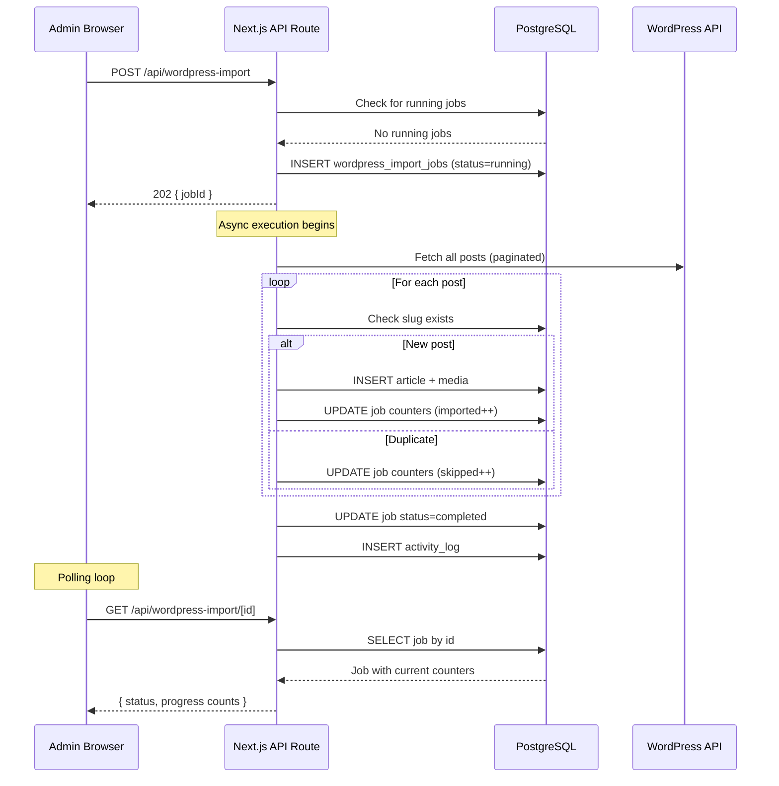
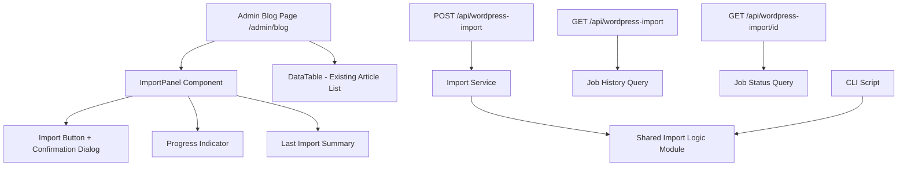

# Design Document: Admin WordPress Import

## Overview

This feature moves the WordPress blog import process from a CLI script (`scripts/import-wordpress.js`) to the admin dashboard at `/admin/blog`. It adds a server-side API layer that wraps the existing import logic, a database table to track import job history and progress, and a UI panel on the admin blog page for triggering imports and monitoring progress in real-time.

The design reuses the existing `extractPostData` and `sanitizeWordPressHtml` functions from the CLI script, wrapping them in a Next.js API route that runs the import asynchronously. A polling-based approach provides real-time progress updates to the admin UI without requiring WebSockets.

### Key Design Decisions

1. **Async execution with polling** — The POST endpoint returns HTTP 202 immediately and runs the import in the background. The UI polls a status endpoint for progress. This avoids request timeouts for large imports and keeps the dashboard responsive.

2. **Reuse existing import logic** — The core functions (`extractPostData`, `sanitizeWordPressHtml`, slug dedup, article/media insertion) are extracted from the CLI script into a shared module. Both the CLI script and the API route consume this module.

3. **Single running job constraint** — Only one import job can run at a time (enforced by checking for `status = 'running'` in the database). This prevents duplicate imports and resource contention.

4. **Per-post progress updates** — The import process updates counters in the `wordpress_import_jobs` table after each post is processed, enabling granular progress tracking.

## Architecture



### Component Layout



## Components and Interfaces

### 1. Shared Import Logic Module (`shared/services/wordpressImport.ts`)

Extracts the pure functions and core import logic from `scripts/import-wordpress.js` into a shared TypeScript module.

```typescript
// Re-exported pure functions
export function extractPostData(post: WordPressPost): ExtractedPost;
export function sanitizeWordPressHtml(html: string): string;

// Core import orchestrator
export async function executeWordPressImport(options: {
  authorId: string;
  jobId: string;
  onProgress: (counts: ImportCounts) => Promise<void>;
}): Promise<ImportResult>;
```

The `executeWordPressImport` function:
- Fetches all posts from the WordPress API (paginated)
- For each post: checks slug uniqueness, inserts article + media
- Calls `onProgress` after each post to update the job record
- Returns final counts

### 2. API Route: POST `/api/wordpress-import` (`frontend/src/app/api/wordpress-import/route.ts`)

```typescript
export async function POST(request: NextRequest): Promise<NextResponse>;
```

- Validates admin session via `validateSession()`
- Checks no job is currently running (`SELECT ... WHERE status = 'running'`)
- Creates a new job record with `status = 'running'`
- Starts async import execution (fire-and-forget promise)
- Returns `202 { success: true, data: { jobId } }`
- Logs `wordpress_import_started` to activity_logs

### 3. API Route: GET `/api/wordpress-import` (`frontend/src/app/api/wordpress-import/route.ts`)

```typescript
export async function GET(request: NextRequest): Promise<NextResponse>;
```

- Validates admin session
- Returns the 10 most recent import jobs ordered by `started_at DESC`
- Joins with `users` table to include the triggering admin's username

### 4. API Route: GET `/api/wordpress-import/[id]` (`frontend/src/app/api/wordpress-import/[id]/route.ts`)

```typescript
export async function GET(request: NextRequest, context: RouteContext): Promise<NextResponse>;
```

- Validates admin session
- Returns a single job record by ID with all fields

### 5. UI Component: ImportPanel (`frontend/src/components/admin/ImportPanel.tsx`)

A client component displayed at the top of the admin blog page.

**State management:**
- `latestJob`: The most recent import job (fetched on mount)
- `activeJob`: The currently running job (if any), updated via polling
- `isImporting`: Whether an import is in progress
- `showConfirm`: Whether the confirmation dialog is visible

**Behavior:**
- On mount: fetches `GET /api/wordpress-import` to get the latest job
- "Impor dari WordPress" button shows confirmation dialog
- On confirm: calls `POST /api/wordpress-import`, starts polling `GET /api/wordpress-import/[id]` every 2 seconds
- Progress display shows: fetched, imported, skipped, failed counts
- Polling stops when status becomes `completed` or `failed`
- On completion: refreshes the article list by calling a callback prop

### 6. Database Migration (`db/migrations/007_create_wordpress_import_jobs.sql`)

Creates the `wordpress_import_jobs` table.

## Data Models

### wordpress_import_jobs Table

| Column | Type | Constraints | Description |
|--------|------|-------------|-------------|
| `id` | UUID | PK, DEFAULT gen_random_uuid() | Job identifier |
| `status` | VARCHAR(20) | NOT NULL, DEFAULT 'running' | running, completed, failed |
| `started_at` | TIMESTAMPTZ | DEFAULT NOW() | When the import started |
| `completed_at` | TIMESTAMPTZ | nullable | When the import finished |
| `total_fetched` | INTEGER | NOT NULL, DEFAULT 0 | Posts fetched from WP API |
| `total_imported` | INTEGER | NOT NULL, DEFAULT 0 | Posts successfully imported |
| `total_skipped` | INTEGER | NOT NULL, DEFAULT 0 | Posts skipped (duplicate slug) |
| `total_failed` | INTEGER | NOT NULL, DEFAULT 0 | Posts that failed to import |
| `error_message` | TEXT | nullable | Error description if failed |
| `triggered_by` | UUID | FK → users(id), NOT NULL | Admin who triggered the import |

**Indexes:**
- `idx_wordpress_import_jobs_status` on `status` — for the running-job check
- `idx_wordpress_import_jobs_started_at` on `started_at DESC` — for history listing

### API Response Shapes

**POST /api/wordpress-import — 202 Accepted:**
```json
{
  "success": true,
  "data": { "jobId": "uuid" }
}
```

**POST /api/wordpress-import — 409 Conflict:**
```json
{
  "success": false,
  "error": {
    "error_code": "IMPORT_ALREADY_RUNNING",
    "message": "Impor sedang berjalan",
    "details": { "jobId": "uuid" },
    "timestamp": "..."
  }
}
```

**GET /api/wordpress-import — 200 OK:**
```json
{
  "success": true,
  "data": {
    "jobs": [
      {
        "id": "uuid",
        "status": "completed",
        "started_at": "ISO",
        "completed_at": "ISO",
        "total_fetched": 45,
        "total_imported": 12,
        "total_skipped": 33,
        "total_failed": 0,
        "error_message": null,
        "triggered_by_username": "admin"
      }
    ]
  }
}
```

**GET /api/wordpress-import/[id] — 200 OK:**
```json
{
  "success": true,
  "data": {
    "job": {
      "id": "uuid",
      "status": "running",
      "started_at": "ISO",
      "completed_at": null,
      "total_fetched": 45,
      "total_imported": 8,
      "total_skipped": 5,
      "total_failed": 0,
      "error_message": null,
      "triggered_by_username": "admin"
    }
  }
}
```

### Shared TypeScript Types

```typescript
// Import job status
export const ImportJobStatus = {
  RUNNING: 'running',
  COMPLETED: 'completed',
  FAILED: 'failed',
} as const;
export type ImportJobStatus = (typeof ImportJobStatus)[keyof typeof ImportJobStatus];

// Import job entity
export interface WordPressImportJob {
  id: string;
  status: ImportJobStatus;
  started_at: Date;
  completed_at: Date | null;
  total_fetched: number;
  total_imported: number;
  total_skipped: number;
  total_failed: number;
  error_message: string | null;
  triggered_by: string;
}

// Progress counts used during import
export interface ImportCounts {
  total_fetched: number;
  total_imported: number;
  total_skipped: number;
  total_failed: number;
}

// WordPress API post shape (subset)
export interface WordPressPost {
  title: { rendered: string };
  content: { rendered: string };
  excerpt: { rendered: string };
  slug: string;
  date: string;
  _embedded?: {
    'wp:featuredmedia'?: Array<{ source_url?: string }>;
  };
}

// Extracted post data
export interface ExtractedPost {
  title: string;
  contentHtml: string;
  excerpt: string;
  slug: string;
  date: string;
  featuredImageUrl: string | null;
}
```


## Correctness Properties

*A property is a characteristic or behavior that should hold true across all valid executions of a system — essentially, a formal statement about what the system should do. Properties serve as the bridge between human-readable specifications and machine-verifiable correctness guarantees.*

### Property 1: HTML sanitization is idempotent

*For any* HTML string, applying `sanitizeWordPressHtml` twice should produce the same result as applying it once. That is, `sanitizeWordPressHtml(sanitizeWordPressHtml(html)) === sanitizeWordPressHtml(html)`.

**Validates: Requirements 8.2, 8.3**

### Property 2: Post data extraction preserves source fields

*For any* valid WordPress post object (with title, content, excerpt, slug, date, and optional featured media), `extractPostData` should return an object where `title` equals `post.title.rendered`, `slug` equals `post.slug`, `date` equals `post.date`, and `featuredImageUrl` equals the embedded media source URL (or null if absent).

**Validates: Requirements 2.6, 8.2**

### Property 3: Import job accounting invariant

*For any* completed import job, the sum `total_imported + total_skipped + total_failed` should equal `total_fetched`. No posts should be unaccounted for.

**Validates: Requirements 2.7, 4.2**

### Property 4: API-imported articles use correct metadata

*For any* WordPress post imported via the API endpoint, the resulting article record should have `category = 'blog'`, `source = 'wordpress'`, and `author_id` equal to the authenticated admin's user ID (not the hardcoded telegram_id=0 user).

**Validates: Requirements 7.4, 8.3**

## Error Handling

### API Error Responses

All API errors follow the existing platform convention:

```json
{
  "success": false,
  "error": {
    "error_code": "ERROR_CODE",
    "message": "Human-readable message in Indonesian",
    "details": null,
    "timestamp": "ISO 8601"
  }
}
```

### Error Scenarios

| Scenario | HTTP Status | Error Code | Message |
|----------|-------------|------------|---------|
| No admin session | 401 | AUTH_REQUIRED | Autentikasi diperlukan |
| Import already running | 409 | IMPORT_ALREADY_RUNNING | Impor sedang berjalan |
| Job not found (GET /[id]) | 404 | RESOURCE_NOT_FOUND | Job impor tidak ditemukan |
| WordPress API unreachable | — | — | Job marked `failed`, error_message set |
| Database error during import | — | — | Job marked `failed`, error_message set |
| Internal server error | 500 | INTERNAL_ERROR | Gagal memproses permintaan |

### Async Error Handling

Since the import runs asynchronously after the 202 response:
- Individual post failures are counted in `total_failed` but don't stop the import
- Fatal errors (WP API down, DB connection lost) set the job to `failed` with the error message
- The async import is wrapped in a try/catch that always updates the job record, even on unexpected errors
- Activity log entries are created for both success and failure outcomes

### New Error Code

Add `IMPORT_ALREADY_RUNNING` to the `ErrorCode` registry in `shared/types/index.ts`:

```typescript
IMPORT_ALREADY_RUNNING: 'IMPORT_ALREADY_RUNNING',  // 409
```

## Testing Strategy

### Unit Tests

Unit tests cover specific examples and edge cases:

1. **`sanitizeWordPressHtml`** — Test with specific HTML patterns:
   - Image with `data-src` and placeholder `src`
   - Image with `data-srcset`
   - Image with `lazyload` class
   - Image with no lazy-load attributes (passthrough)
   - HTML with no images

2. **`extractPostData`** — Test with specific WordPress post shapes:
   - Post with featured media
   - Post without featured media (`_embedded` absent)
   - Post with HTML entities in title

3. **API route handlers** — Example-based tests:
   - POST returns 401 without auth
   - POST returns 202 with valid auth
   - POST returns 409 when job is already running
   - GET returns job history ordered by started_at DESC
   - GET /[id] returns 404 for non-existent job
   - Activity log entries are created on start, completion, and failure

4. **Import job state transitions** — Example-based tests:
   - New job has status=running, started_at set
   - Completed job has status=completed, completed_at set
   - Failed job has status=failed, error_message set

### Property-Based Tests

Property-based tests verify universal properties across generated inputs. Use `fast-check` as the PBT library (already standard for TypeScript/JavaScript projects).

Each property test runs a minimum of 100 iterations and is tagged with the corresponding design property.

1. **Property 1: HTML sanitization idempotence**
   - Generator: arbitrary HTML strings including `` tags with various combinations of `src`, `data-src`, `data-srcset`, `data-sizes`, and `class="lazyload"` attributes
   - Assertion: `sanitizeWordPressHtml(sanitizeWordPressHtml(html)) === sanitizeWordPressHtml(html)`
   - Tag: `Feature: admin-wordpress-import, Property 1: HTML sanitization is idempotent`

2. **Property 2: Post data extraction preserves source fields**
   - Generator: arbitrary WordPress post objects with random titles, slugs, dates, content, and optional featured media
   - Assertion: extracted fields match source post fields
   - Tag: `Feature: admin-wordpress-import, Property 2: Post data extraction preserves source fields`

3. **Property 3: Import job accounting invariant**
   - Generator: arbitrary sets of WordPress posts (some with duplicate slugs, some with valid data, some that will fail)
   - Assertion: after import completes, `total_imported + total_skipped + total_failed === total_fetched`
   - Tag: `Feature: admin-wordpress-import, Property 3: Import job accounting invariant`

4. **Property 4: API-imported articles use correct metadata**
   - Generator: arbitrary WordPress posts with random content
   - Assertion: all resulting article records have `category='blog'`, `source='wordpress'`, `author_id` matches the admin
   - Tag: `Feature: admin-wordpress-import, Property 4: API-imported articles use correct metadata`

### Integration Tests

Integration tests verify the full pipeline with mocked external dependencies:

1. **Full import flow** — Mock WordPress API, run import, verify articles in DB
2. **Progress updates** — Mock WordPress API with multiple posts, verify counters increment
3. **CLI script compatibility** — Verify `scripts/import-wordpress.js` still works after refactoring shared logic
