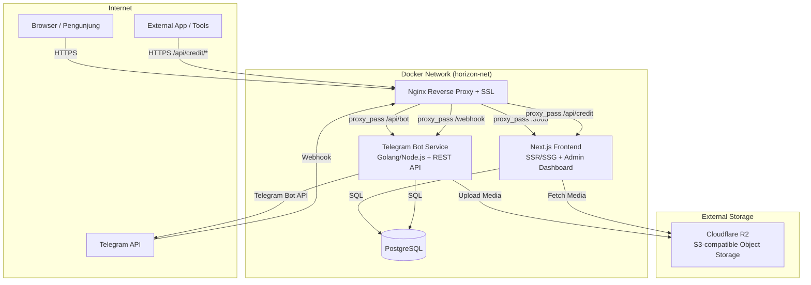
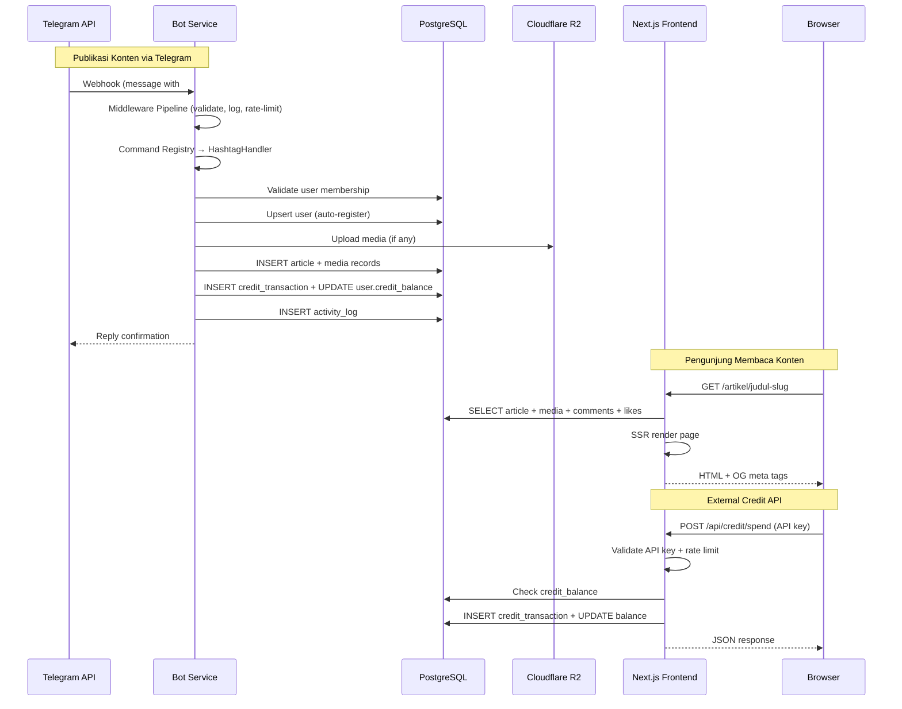
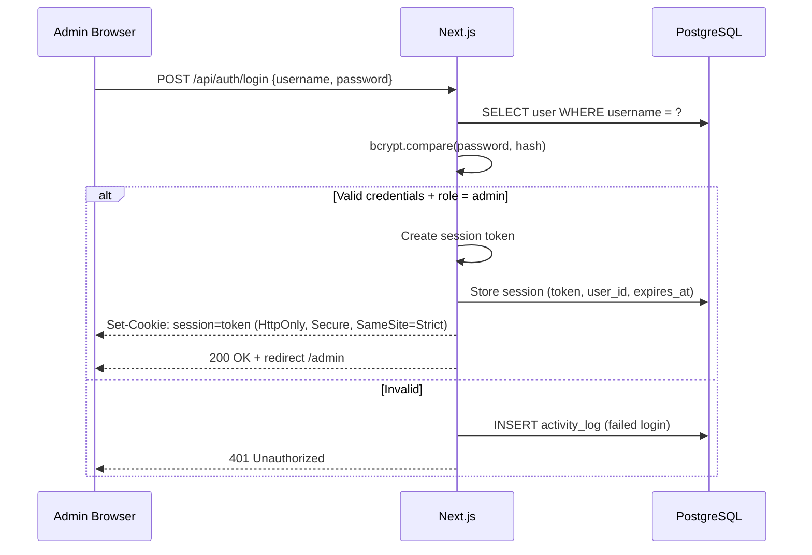
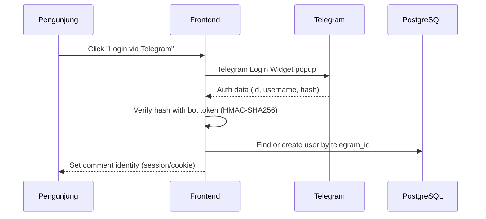
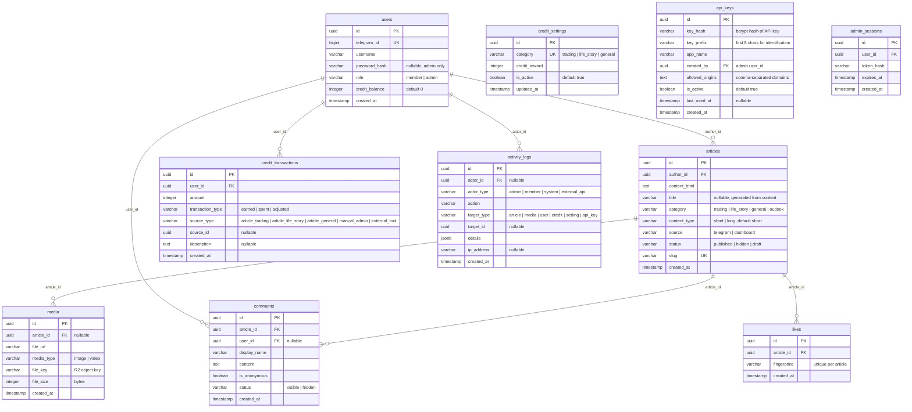
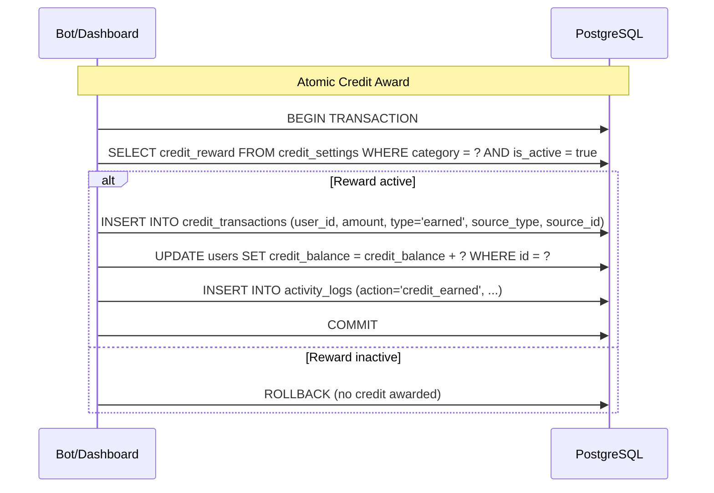

# Design Document: Horizon Trader Platform

## Overview

Horizon Trader Platform adalah sistem komunitas trader berbasis web yang menggabungkan Telegram Bot, website bergaya retro blogger, dan admin dashboard. Platform ini menangkap konten dari grup Telegram (jurnal trading, cerita kehidupan, analisa market) dan menyajikannya sebagai blog terarsip dengan fitur interaksi sosial (komentar, like), sistem credit reward, dan API eksternal.

### Arsitektur Tingkat Tinggi

Platform terdiri dari 4 service utama yang berjalan dalam Docker Compose:



### Keputusan Arsitektur Utama

| Keputusan | Pilihan | Alasan |
|-----------|---------|--------|
| Frontend Framework | Next.js (App Router) | SSR/SSG untuk SEO, API routes untuk backend logic, Image optimization built-in |
| Bot Service | Node.js + Express | Ekosistem npm untuk Telegram Bot library (grammy/telegraf), shared language dengan Frontend |
| Database | PostgreSQL | JSONB support untuk activity_logs details, UUID native, robust referential integrity |
| Object Storage | Cloudflare R2 | S3-compatible, zero egress fees, global CDN |
| Reverse Proxy | Nginx | SSL termination, routing, static file caching, rate limiting |
| Deployment | Docker Compose | Single-server deployment, service isolation, reproducible environment |
| Auth (Admin) | Session-based + HTTP-only cookie | Simple, secure, no JWT complexity untuk single-app admin |
| Auth (Comments) | Telegram Login Widget | Sesuai ekosistem komunitas Telegram, no separate registration |

## Architecture

### Service Communication Flow



### Routing Architecture (Nginx)

```
/ → Frontend (Next.js :3000)
/api/bot/* → Bot Service (:4000)
/api/credit/* → Frontend API Routes (:3000)
/webhook/telegram → Bot Service (:4000)
/admin/* → Frontend (Next.js :3000, protected)
```

Nginx menangani SSL termination, static asset caching, dan rate limiting pada level reverse proxy. Semua komunikasi internal antar service menggunakan Docker network tanpa SSL.


## Components and Interfaces

### 1. Next.js Frontend

Frontend menggunakan Next.js App Router dengan kombinasi Server Components (default) dan Client Components (interaktif).

#### Page Structure

```
app/
├── layout.tsx                    # Root layout: font, theme, navbar
├── page.tsx                      # Feed page (SSR) — Req 1
├── artikel/[slug]/page.tsx       # Article detail (SSG + ISR) — Req 20, 21, 26
├── outlook/page.tsx              # Outlook listing (SSR) — Req 27
├── outlook/[slug]/page.tsx       # Outlook detail (SSG + ISR) — Req 27
├── gallery/page.tsx              # Gallery grid (SSR) — Req 3
├── admin/
│   ├── layout.tsx                # Admin layout with auth guard
│   ├── login/page.tsx            # Admin login — Req 25
│   ├── page.tsx                  # Dashboard statistics — Req 22
│   ├── articles/page.tsx         # Article management — Req 5
│   ├── articles/new/page.tsx     # Upload article — Req 6
│   ├── articles/[id]/edit/page.tsx # Edit article — Req 5
│   ├── outlook/new/page.tsx      # Upload outlook — Req 27
│   ├── users/page.tsx            # User management — Req 7
│   ├── users/[id]/page.tsx       # User profile detail — Req 22
│   ├── credits/page.tsx          # Credit settings — Req 17
│   ├── comments/page.tsx         # Comment moderation — Req 26
│   ├── logs/page.tsx             # Activity logs — Req 23
│   └── api-keys/page.tsx         # API key management — Req 18
├── api/
│   ├── auth/login/route.ts       # Admin login endpoint
│   ├── auth/logout/route.ts      # Admin logout endpoint
│   ├── articles/route.ts         # Articles CRUD
│   ├── articles/[id]/route.ts    # Single article operations
│   ├── media/upload/route.ts     # Media upload to R2
│   ├── comments/route.ts         # Comments CRUD
│   ├── likes/route.ts            # Like toggle
│   ├── users/route.ts            # User management
│   ├── users/[id]/route.ts       # Single user operations
│   ├── credit/
│   │   ├── settings/route.ts     # Credit settings CRUD
│   │   ├── balance/route.ts      # Read balance (external API)
│   │   ├── history/route.ts      # Transaction history (external API)
│   │   ├── spend/route.ts        # Spend credit (external API)
│   │   └── adjust/route.ts       # Manual adjustment (admin)
│   ├── api-keys/route.ts         # API key management
│   ├── logs/route.ts             # Activity logs query
│   └── stats/route.ts            # Dashboard statistics
└── sitemap.ts                    # Dynamic sitemap — Req 21
```

#### Component Architecture

```
components/
├── layout/
│   ├── Navbar.tsx                # 3 items: Feed, Outlook, Gallery (Server Component)
│   ├── Sidebar.tsx               # Retro sidebar: kategori, info komunitas
│   ├── MobileMenu.tsx            # Hamburger overlay ('use client')
│   └── Footer.tsx
├── feed/
│   ├── ArticleCard.tsx           # Card untuk short content
│   ├── ArticleLongCard.tsx       # Card untuk long-form preview
│   ├── CategoryTabs.tsx          # Filter tabs ('use client') — Req 1
│   └── FeedList.tsx              # Article list with pagination
├── article/
│   ├── ArticleContent.tsx        # Rendered HTML content
│   ├── ArticleMeta.tsx           # Author, date, read time
│   ├── ShareButtons.tsx          # Social share ('use client') — Req 20
│   ├── LikeButton.tsx            # Like with fingerprint ('use client') — Req 26
│   └── CommentSection.tsx        # Comments ('use client') — Req 26
├── gallery/
│   ├── GalleryGrid.tsx           # Instagram-style grid
│   ├── GalleryItem.tsx           # Square thumbnail with overlay
│   └── Lightbox.tsx              # Modal media viewer ('use client') — Req 3
├── outlook/
│   ├── OutlookCard.tsx           # Outlook article card with badge
│   └── OutlookContent.tsx        # Long-form reading layout
├── admin/
│   ├── StatsCards.tsx            # Dashboard summary cards
│   ├── Charts.tsx                # Activity & distribution charts ('use client')
│   ├── ArticleEditor.tsx         # Rich text editor ('use client')
│   ├── OutlookEditor.tsx         # Outlook editor with inline images ('use client')
│   ├── DataTable.tsx             # Reusable data table component
│   ├── LogViewer.tsx             # Activity log viewer with filters
│   ├── CreditSettings.tsx        # Credit configuration form
│   └── UserProfile.tsx           # Member profile detail
├── ui/
│   ├── SkeletonLoader.tsx        # Layout-matching skeleton — Req 19
│   ├── ErrorPage.tsx             # Custom error pages — Req 24
│   ├── Pagination.tsx            # Pagination component
│   └── Toast.tsx                 # Notification toast ('use client')
└── auth/
    ├── TelegramLoginWidget.tsx   # Telegram Login Widget ('use client') — Req 26
    └── AdminAuthGuard.tsx        # Session validation wrapper
```

### 2. Telegram Bot Service

Bot service menggunakan Node.js dengan arsitektur command registry pattern dan middleware pipeline.

#### Architecture Diagram

```mermaid
graph LR
    subgraph "Bot Service"
        Webhook[Webhook Handler]
        MW[Middleware Pipeline]
        Registry[Command Registry]

        subgraph "Middlewares"
            Auth[Auth Middleware<br/>Group Membership Check]
            Log[Logging Middleware]
            Rate[Rate Limiter]
            AutoReg[Auto-Register Middleware]
        end

        subgraph "Command Handlers"
            HashtagH[Hashtag Handler<br/>#jurnal #cerita etc]
            StoryH[/story Handler]
            CeritaH[/cerita Handler]
            PublishH[/publish Handler<br/>Admin only]
            HelpH[/help Handler]
        end

        subgraph "Services"
            ArticleSvc[Article Service]
            MediaSvc[Media Service]
            CreditSvc[Credit Service]
            UserSvc[User Service]
            LogSvc[Activity Log Service]
        end

        REST[REST API Server<br/>Express.js :4000]
    end

    Webhook --> MW
    MW --> Auth --> Log --> Rate --> AutoReg --> Registry
    Registry --> HashtagH & StoryH & CeritaH & PublishH & HelpH
    HashtagH & StoryH & CeritaH & PublishH --> ArticleSvc & MediaSvc & CreditSvc
    ArticleSvc & MediaSvc & CreditSvc & UserSvc --> DB[(PostgreSQL)]
    MediaSvc --> R2[Cloudflare R2]
    REST --> ArticleSvc & UserSvc & LogSvc
```

#### Command Handler Interface

```typescript
interface CommandHandler {
  name: string;              // e.g., "/story", "#jurnal"
  description: string;       // Human-readable description
  permission: 'admin' | 'member' | 'all';
  type: 'command' | 'hashtag';
  execute(ctx: BotContext): Promise<void>;
}

interface BotContext {
  message: TelegramMessage;
  user: User;
  reply(text: string): Promise<void>;
  replyWithError(error: AppError): Promise<void>;
}

interface CommandRegistry {
  register(handler: CommandHandler): void;
  resolve(message: TelegramMessage): CommandHandler | null;
  listCommands(): CommandHandler[];
}
```

#### Middleware Pipeline Interface

```typescript
type MiddlewareFn = (ctx: BotContext, next: () => Promise<void>) => Promise<void>;

interface MiddlewarePipeline {
  use(middleware: MiddlewareFn): void;
  execute(ctx: BotContext): Promise<void>;
}
```

#### REST API Endpoints (Bot Internal)

| Method | Path | Description |
|--------|------|-------------|
| GET | `/api/bot/status` | Bot health & uptime |
| GET | `/api/bot/commands` | List registered commands |
| GET | `/api/bot/stats` | Command usage statistics |
| POST | `/api/bot/notify` | Send notification to group |

### 3. Credit API (External Access)

REST API yang diekspos melalui Next.js API routes untuk akses aplikasi eksternal.

#### Endpoints

| Method | Path | Auth | Description |
|--------|------|------|-------------|
| GET | `/api/credit/balance?user_id={id}` | API Key | Baca saldo credit user |
| GET | `/api/credit/balance?telegram_id={id}` | API Key | Baca saldo credit via Telegram ID |
| GET | `/api/credit/history?user_id={id}` | API Key | Riwayat transaksi credit |
| POST | `/api/credit/spend` | API Key | Kurangi credit user |

#### Request/Response Format

**Spend Credit Request:**
```json
{
  "user_id": "uuid-string",
  "amount": 10,
  "description": "Used for signal tool access"
}
```

**Spend Credit Response (Success):**
```json
{
  "success": true,
  "data": {
    "transaction_id": "uuid-string",
    "user_id": "uuid-string",
    "amount": 10,
    "remaining_balance": 45,
    "transaction_type": "spent",
    "source_type": "external_tool",
    "created_at": "2024-01-15T10:30:00Z"
  }
}
```

**Error Response:**
```json
{
  "success": false,
  "error": {
    "error_code": "CREDIT_INSUFFICIENT",
    "message": "Saldo credit tidak mencukupi",
    "details": {
      "current_balance": 5,
      "requested_amount": 10
    },
    "timestamp": "2024-01-15T10:30:00Z"
  }
}
```

#### API Key Authentication

API key dikirim via header `X-API-Key`. Setiap key disimpan di database (hashed) dengan metadata: nama aplikasi, created_by (admin), created_at, last_used_at, is_active, allowed_origins (untuk CORS).

#### Rate Limiting

- 100 requests per menit per API key
- 10 spend requests per menit per API key
- Response header: `X-RateLimit-Remaining`, `X-RateLimit-Reset`
- HTTP 429 saat limit tercapai

### 4. Authentication Flow

#### Admin Dashboard Login



#### Telegram Login Widget (Comments)




## Data Models

### Entity Relationship Diagram



### Database Schema SQL

```sql
-- Users table
CREATE TABLE users (
    id UUID PRIMARY KEY DEFAULT gen_random_uuid(),
    telegram_id BIGINT UNIQUE,
    username VARCHAR(255),
    password_hash VARCHAR(255),  -- nullable, only for admin accounts
    role VARCHAR(20) NOT NULL DEFAULT 'member',
    credit_balance INTEGER NOT NULL DEFAULT 0,
    created_at TIMESTAMP WITH TIME ZONE DEFAULT NOW()
);

CREATE INDEX idx_users_telegram_id ON users(telegram_id);
CREATE INDEX idx_users_role ON users(role);

-- Articles table
CREATE TABLE articles (
    id UUID PRIMARY KEY DEFAULT gen_random_uuid(),
    author_id UUID NOT NULL REFERENCES users(id),
    content_html TEXT NOT NULL,
    title VARCHAR(500),
    category VARCHAR(50) NOT NULL,
    content_type VARCHAR(20) NOT NULL DEFAULT 'short',
    source VARCHAR(50) NOT NULL,
    status VARCHAR(20) NOT NULL DEFAULT 'published',
    slug VARCHAR(500) UNIQUE NOT NULL,
    created_at TIMESTAMP WITH TIME ZONE DEFAULT NOW()
);

CREATE INDEX idx_articles_category ON articles(category);
CREATE INDEX idx_articles_status ON articles(status);
CREATE INDEX idx_articles_slug ON articles(slug);
CREATE INDEX idx_articles_created_at ON articles(created_at DESC);
CREATE INDEX idx_articles_author_id ON articles(author_id);
CREATE INDEX idx_articles_status_category ON articles(status, category);

-- Media table
CREATE TABLE media (
    id UUID PRIMARY KEY DEFAULT gen_random_uuid(),
    article_id UUID REFERENCES articles(id) ON DELETE CASCADE,
    file_url VARCHAR(1000) NOT NULL,
    media_type VARCHAR(20) NOT NULL,
    file_key VARCHAR(500),
    file_size INTEGER,
    created_at TIMESTAMP WITH TIME ZONE DEFAULT NOW()
);

CREATE INDEX idx_media_article_id ON media(article_id);
CREATE INDEX idx_media_created_at ON media(created_at DESC);

-- Credit transactions table
CREATE TABLE credit_transactions (
    id UUID PRIMARY KEY DEFAULT gen_random_uuid(),
    user_id UUID NOT NULL REFERENCES users(id),
    amount INTEGER NOT NULL,
    transaction_type VARCHAR(20) NOT NULL,
    source_type VARCHAR(50) NOT NULL,
    source_id UUID,
    description TEXT,
    created_at TIMESTAMP WITH TIME ZONE DEFAULT NOW()
);

CREATE INDEX idx_credit_transactions_user_id ON credit_transactions(user_id);
CREATE INDEX idx_credit_transactions_created_at ON credit_transactions(created_at DESC);

-- Credit settings table
CREATE TABLE credit_settings (
    id UUID PRIMARY KEY DEFAULT gen_random_uuid(),
    category VARCHAR(50) UNIQUE NOT NULL,
    credit_reward INTEGER NOT NULL DEFAULT 0,
    is_active BOOLEAN NOT NULL DEFAULT true,
    updated_at TIMESTAMP WITH TIME ZONE DEFAULT NOW()
);

-- Activity logs table (immutable)
CREATE TABLE activity_logs (
    id UUID PRIMARY KEY DEFAULT gen_random_uuid(),
    actor_id UUID REFERENCES users(id),
    actor_type VARCHAR(50) NOT NULL,
    action VARCHAR(100) NOT NULL,
    target_type VARCHAR(50),
    target_id UUID,
    details JSONB,
    ip_address VARCHAR(45),
    created_at TIMESTAMP WITH TIME ZONE DEFAULT NOW()
);

CREATE INDEX idx_activity_logs_actor_id ON activity_logs(actor_id);
CREATE INDEX idx_activity_logs_action ON activity_logs(action);
CREATE INDEX idx_activity_logs_target_type ON activity_logs(target_type);
CREATE INDEX idx_activity_logs_created_at ON activity_logs(created_at DESC);
CREATE INDEX idx_activity_logs_details ON activity_logs USING GIN(details);

-- Comments table
CREATE TABLE comments (
    id UUID PRIMARY KEY DEFAULT gen_random_uuid(),
    article_id UUID NOT NULL REFERENCES articles(id) ON DELETE CASCADE,
    user_id UUID REFERENCES users(id),
    display_name VARCHAR(255) NOT NULL DEFAULT 'Anonim',
    content TEXT NOT NULL,
    is_anonymous BOOLEAN NOT NULL DEFAULT true,
    status VARCHAR(20) NOT NULL DEFAULT 'visible',
    created_at TIMESTAMP WITH TIME ZONE DEFAULT NOW()
);

CREATE INDEX idx_comments_article_id ON comments(article_id);
CREATE INDEX idx_comments_status ON comments(status);

-- Likes table
CREATE TABLE likes (
    id UUID PRIMARY KEY DEFAULT gen_random_uuid(),
    article_id UUID NOT NULL REFERENCES articles(id) ON DELETE CASCADE,
    fingerprint VARCHAR(255) NOT NULL,
    created_at TIMESTAMP WITH TIME ZONE DEFAULT NOW(),
    UNIQUE(article_id, fingerprint)
);

CREATE INDEX idx_likes_article_id ON likes(article_id);

-- API keys table
CREATE TABLE api_keys (
    id UUID PRIMARY KEY DEFAULT gen_random_uuid(),
    key_hash VARCHAR(255) NOT NULL,
    key_prefix VARCHAR(8) NOT NULL,
    app_name VARCHAR(255) NOT NULL,
    created_by UUID NOT NULL REFERENCES users(id),
    allowed_origins TEXT,
    is_active BOOLEAN NOT NULL DEFAULT true,
    last_used_at TIMESTAMP WITH TIME ZONE,
    created_at TIMESTAMP WITH TIME ZONE DEFAULT NOW()
);

-- Admin sessions table
CREATE TABLE admin_sessions (
    id UUID PRIMARY KEY DEFAULT gen_random_uuid(),
    user_id UUID NOT NULL REFERENCES users(id),
    token_hash VARCHAR(255) NOT NULL,
    expires_at TIMESTAMP WITH TIME ZONE NOT NULL,
    created_at TIMESTAMP WITH TIME ZONE DEFAULT NOW()
);

CREATE INDEX idx_admin_sessions_token_hash ON admin_sessions(token_hash);
CREATE INDEX idx_admin_sessions_expires_at ON admin_sessions(expires_at);

-- Seed credit settings
INSERT INTO credit_settings (category, credit_reward, is_active) VALUES
    ('trading', 10, true),
    ('life_story', 5, true),
    ('general', 3, true);
```

### Slug Generation Strategy

Slug dihasilkan dari judul artikel menggunakan algoritma:
1. Ambil 60 karakter pertama dari judul/konten
2. Lowercase, replace spasi dengan `-`, hapus karakter non-alphanumeric
3. Append 6-char random suffix untuk uniqueness: `judul-artikel-abc123`
4. Untuk artikel dari Telegram tanpa judul eksplisit, gunakan 8 kata pertama dari konten

### Credit Transaction Flow




## Correctness Properties

*A property is a characteristic or behavior that should hold true across all valid executions of a system — essentially, a formal statement about what the system should do. Properties serve as the bridge between human-readable specifications and machine-verifiable correctness guarantees.*

### Property 1: Chronological Sort Invariant

*For any* list of articles (or media items) returned by the platform, each item's `created_at` timestamp SHALL be greater than or equal to the `created_at` of the next item in the list, ensuring reverse chronological order is always maintained.

**Validates: Requirements 1.1, 3.6**

### Property 2: Published-Only Filter

*For any* set of articles with mixed statuses (published, hidden, draft), the public feed/gallery filter function SHALL return only articles where `status === "published"`, and the count of returned articles SHALL equal the count of published articles in the input set.

**Validates: Requirements 1.2, 5.3**

### Property 3: Category Filter Correctness

*For any* set of published articles and any selected category filter (including "all"), the filter function SHALL return exactly those articles matching the selected category — or all articles when "all" is selected. The count of filtered results SHALL equal the count of articles with that category in the input set.

**Validates: Requirements 1.5, 1.6, 1.7**

### Property 4: Pagination Invariant

*For any* list of N items and page size P (where P > 0), the pagination function SHALL produce exactly `ceil(N / P)` pages, each page SHALL contain at most P items, and the union of all pages SHALL equal the original list without duplicates or omissions.

**Validates: Requirements 1.8**

### Property 5: Hashtag-to-Category Mapping

*For any* Telegram message text, the hashtag parser SHALL map `#jurnal` and `#trading` to category "trading", `#cerita` and `#kehidupan` to category "life_story", and messages without recognized hashtags to category "general". The mapping SHALL be deterministic — the same input always produces the same category.

**Validates: Requirements 8.1, 8.2, 9.2, 9.3**

### Property 6: Command Routing Correctness

*For any* valid bot command, the command registry SHALL route `/story` to produce articles with `{category: "life_story", content_type: "short"}` and `/cerita` to produce articles with `{category: "life_story", content_type: "long"}`. Unregistered commands SHALL resolve to null.

**Validates: Requirements 8.3, 8.4, 8.7, 15.8**

### Property 7: Text-to-HTML Content Preservation

*For any* plain text input string, the text-to-HTML conversion function SHALL produce output that, when stripped of HTML tags, contains the original text content. This is a round-trip property: `stripHtml(toHtml(text))` SHALL contain all words from `text`.

**Validates: Requirements 8.5**

### Property 8: Permission Enforcement

*For any* user with role other than "admin", attempting to execute the `/publish` command SHALL be rejected. *For any* user with role "admin", the command SHALL be accepted (assuming valid message context).

**Validates: Requirements 9.4**

### Property 9: Command Registry Dynamic Registration

*For any* valid command handler registered with the command registry, the registry SHALL subsequently resolve that command name to the registered handler. The number of registered commands SHALL equal the number of unique registrations.

**Validates: Requirements 15.3**

### Property 10: Middleware Execution Order

*For any* sequence of N middlewares registered in the pipeline, execution SHALL proceed in registration order. If middleware at index `i` calls `next()`, middleware at index `i+1` SHALL execute next. The execution trace SHALL match the registration order.

**Validates: Requirements 15.7**

### Property 11: Credit Calculation from Settings

*For any* published article with a given category, the credit reward amount SHALL equal the `credit_reward` value from `credit_settings` for that category when `is_active` is true, and SHALL be 0 when `is_active` is false.

**Validates: Requirements 16.1, 16.2**

### Property 12: Credit Balance Invariant

*For any* user and any sequence of credit transactions (earned, spent, adjusted), the user's `credit_balance` SHALL equal the sum of all transaction amounts for that user. This invariant SHALL hold after every transaction.

**Validates: Requirements 16.4**

### Property 13: Credit Finality After Deletion

*For any* user who has earned credit from an article, if that article is subsequently deleted or hidden, the user's `credit_balance` SHALL remain unchanged. Earned credits are final and irrevocable.

**Validates: Requirements 16.5**

### Property 14: Credit Spend Balance Validation

*For any* credit spend request with amount `A` and user with balance `B`: if `A <= B`, the spend SHALL succeed and the new balance SHALL be `B - A`; if `A > B`, the spend SHALL be rejected and the balance SHALL remain `B`.

**Validates: Requirements 18.5, 18.6**

### Property 15: API Key Authentication Enforcement

*For any* request to the Credit API, if the request does not include a valid, active API key in the `X-API-Key` header, the API SHALL return HTTP 401. *For any* request with a valid, active API key, the API SHALL proceed to process the request.

**Validates: Requirements 18.2**

### Property 16: OG Meta Tag Completeness

*For any* article, the generated Open Graph meta tags SHALL include `og:title`, `og:description`, `og:url`, and `og:image`. When the article has associated media, `og:image` SHALL use the first media item's URL; otherwise, it SHALL use the platform default image.

**Validates: Requirements 20.6, 20.7**

### Property 17: Slug Generation Validity

*For any* article title or content string, the generated slug SHALL be non-empty, contain only lowercase alphanumeric characters and hyphens, not start or end with a hyphen, and be unique (via random suffix). `slugify(input)` SHALL always produce a valid URL path segment.

**Validates: Requirements 21.6**

### Property 18: Error Response Structure Consistency

*For any* API error response, the response body SHALL contain `error_code` (non-empty string), `message` (non-empty string), `details` (object or null), and `timestamp` (valid ISO 8601 string). The HTTP status code SHALL match the error type mapping (400, 401, 403, 404, 422, 429, 500).

**Validates: Requirements 24.1, 24.7**

### Property 19: No Internal Info Leakage in Bot Errors

*For any* error message sent by the Telegram Bot to users, the message SHALL NOT contain stack traces, database table names, SQL queries, internal file paths, or environment variable values. The message SHALL contain only user-friendly descriptions.

**Validates: Requirements 24.5**

### Property 20: Like Idempotency Per Fingerprint

*For any* article and browser fingerprint, applying the like operation multiple times SHALL result in exactly one like record in the database. The like count for that article from that fingerprint SHALL always be 1, regardless of how many times the operation is invoked.

**Validates: Requirements 26.2**

### Property 21: Bot Never Produces Outlook Category

*For any* message processed by the Telegram Bot (regardless of hashtags, commands, or content), the resulting article SHALL never have category "outlook". The "outlook" category is exclusively created through the Admin Dashboard.

**Validates: Requirements 27.7**

### Property 22: Media Type Validation

*For any* uploaded file, the media type validator SHALL accept only files with MIME types matching `image/*` or `video/*`. All other MIME types SHALL be rejected with a descriptive error message.

**Validates: Requirements 6.4**


## Error Handling

### Error Response Format (Unified)

Seluruh API endpoint (Frontend API routes, Credit API, Bot REST API) menggunakan format error yang konsisten:

```typescript
interface ApiErrorResponse {
  success: false;
  error: {
    error_code: string;    // e.g., "CREDIT_INSUFFICIENT", "AUTH_REQUIRED"
    message: string;       // Human-readable, Bahasa Indonesia
    details: object | null;// Contextual info
    timestamp: string;     // ISO 8601
  };
}

interface ApiSuccessResponse<T> {
  success: true;
  data: T;
}
```

### Error Code Registry

| Error Code | HTTP Status | Deskripsi |
|------------|-------------|-----------|
| `AUTH_REQUIRED` | 401 | Session/API key tidak ditemukan |
| `AUTH_INVALID` | 401 | Session expired atau API key tidak valid |
| `AUTH_FORBIDDEN` | 403 | Role tidak memiliki akses |
| `RESOURCE_NOT_FOUND` | 404 | Article, user, atau resource tidak ditemukan |
| `VALIDATION_ERROR` | 422 | Input tidak valid (field-level details) |
| `CREDIT_INSUFFICIENT` | 422 | Saldo credit tidak mencukupi |
| `MEDIA_TYPE_INVALID` | 422 | File bukan gambar atau video |
| `MEDIA_SIZE_EXCEEDED` | 422 | File melebihi batas ukuran (50MB) |
| `RATE_LIMIT_EXCEEDED` | 429 | Terlalu banyak request |
| `INTERNAL_ERROR` | 500 | Server error (detail di-log, tidak diekspos) |

### Error Handling per Layer

#### Frontend (Next.js)

- **Custom error pages**: `app/not-found.tsx` (404), `app/error.tsx` (500) dengan pesan Bahasa Indonesia
- **Form validation**: Inline error di bawah field yang bermasalah
- **API call errors**: Toast notification untuk operasi async (save, delete, upload)
- **Skeleton loaders**: Ditampilkan saat data loading untuk menghindari layout shift

#### Telegram Bot

- **User-facing errors**: Pesan deskriptif tanpa info teknis internal
  - Format: "Gagal [aksi]. [Penyebab]. [Saran tindakan]."
  - Contoh: "Gagal mempublikasikan artikel. Media terlalu besar (maks 50MB). Coba kirim ulang dengan file yang lebih kecil."
- **Internal errors**: Full stack trace + context ke server log dan activity_logs
- **Telegram API errors**: Retry dengan exponential backoff (max 3 attempts)
- **Media upload errors**: Log error, tetap publish artikel tanpa media

#### Credit API

- **Balance check**: Atomic read + compare sebelum spend operation
- **Race condition**: Database-level locking (`SELECT ... FOR UPDATE`) pada credit_balance
- **Rate limiting**: Per API key, response dengan `Retry-After` header

### Activity Log untuk Error Tracking

Setiap error pada proses background dicatat ke `activity_logs`:

```json
{
  "actor_type": "system",
  "action": "error",
  "target_type": "media",
  "target_id": "uuid-of-failed-media",
  "details": {
    "error_message": "R2 upload timeout after 30s",
    "stack_trace": "Error: timeout at ...",
    "context": {
      "article_id": "uuid",
      "file_size": 15000000,
      "media_type": "video"
    }
  }
}
```

## Testing Strategy

### Testing Framework dan Tools

| Layer | Framework | Library |
|-------|-----------|---------|
| Frontend Unit Tests | Vitest | @testing-library/react, msw (API mocking) |
| Frontend E2E | Playwright | - |
| Bot Unit Tests | Vitest | - |
| Bot Integration | Vitest | testcontainers (PostgreSQL) |
| Property-Based Tests | Vitest + fast-check | fast-check |
| Database | Vitest | testcontainers (PostgreSQL) |

### Dual Testing Approach

#### Unit Tests (Example-Based)

Unit tests fokus pada specific examples, edge cases, dan error conditions:

- **Frontend components**: Render test untuk setiap page dan component utama
- **API routes**: Request/response test untuk setiap endpoint
- **Bot command handlers**: Test dengan mock Telegram context
- **Admin auth flow**: Login, session validation, redirect behavior
- **Error pages**: Render test untuk setiap HTTP error code
- **Responsive layout**: Viewport-specific rendering tests

#### Property-Based Tests (fast-check)

Property tests memvalidasi universal properties across all inputs. Setiap property test:
- Menggunakan library **fast-check** untuk TypeScript
- Minimum **100 iterations** per property
- Di-tag dengan comment referencing design property
- Format tag: `Feature: horizon-trader-platform, Property {number}: {property_text}`

**Property tests yang akan diimplementasikan:**

1. **Sorting & Filtering** (Properties 1-3): Article/media sort order, published filter, category filter
2. **Pagination** (Property 4): Page count, item distribution, no duplicates
3. **Bot Routing** (Properties 5-6): Hashtag mapping, command routing, message rejection
4. **Content Processing** (Property 7): Text-to-HTML round trip
5. **Permission System** (Property 8): Role-based command access
6. **Command Registry** (Properties 9-10): Dynamic registration, middleware order
7. **Credit System** (Properties 11-14): Calculation, balance invariant, finality, spend validation
8. **API Security** (Property 15): API key enforcement
9. **SEO** (Properties 16-17): OG tags, slug generation
10. **Error Handling** (Properties 18-19): Response structure, no info leakage
11. **Social Features** (Property 20): Like idempotency
12. **Category Restriction** (Property 21): Bot never produces "outlook"
13. **Media Validation** (Property 22): MIME type acceptance/rejection

#### Integration Tests

Integration tests untuk external service interactions:

- **Database**: CRUD operations, referential integrity, cascade deletes
- **R2 Object Storage**: Upload, download, delete media files (mocked in CI)
- **Telegram API**: Webhook processing, message parsing (mocked)
- **Credit API**: End-to-end spend flow, rate limiting
- **Auth flow**: Login → session → protected route → logout

#### Smoke Tests

Smoke tests untuk configuration dan setup:

- Database schema matches specification (all tables, columns, constraints)
- Docker Compose services start and communicate
- Nginx routing rules work correctly
- Environment variables are loaded
- Health check endpoints respond

### Test Organization

```
tests/
├── unit/
│   ├── frontend/
│   │   ├── components/       # Component render tests
│   │   ├── api/              # API route handler tests
│   │   └── utils/            # Utility function tests
│   └── bot/
│       ├── handlers/         # Command handler tests
│       ├── middleware/        # Middleware tests
│       └── services/         # Service layer tests
├── property/
│   ├── sorting.property.test.ts      # Properties 1-3
│   ├── pagination.property.test.ts   # Property 4
│   ├── bot-routing.property.test.ts  # Properties 5-6, 8, 21
│   ├── content.property.test.ts      # Property 7
│   ├── registry.property.test.ts     # Properties 9-10
│   ├── credit.property.test.ts       # Properties 11-14
│   ├── api-auth.property.test.ts     # Property 15
│   ├── seo.property.test.ts          # Properties 16-17
│   ├── error.property.test.ts        # Properties 18-19
│   ├── social.property.test.ts       # Property 20
│   └── media.property.test.ts        # Property 22
├── integration/
│   ├── database.test.ts
│   ├── credit-api.test.ts
│   ├── telegram-webhook.test.ts
│   └── media-upload.test.ts
└── e2e/
    ├── feed.spec.ts
    ├── gallery.spec.ts
    ├── article-detail.spec.ts
    ├── admin-dashboard.spec.ts
    └── outlook.spec.ts
```

### Property Test Configuration

```typescript
// vitest.config.ts (property tests)
import { defineConfig } from 'vitest/config';

export default defineConfig({
  test: {
    include: ['tests/property/**/*.property.test.ts'],
    testTimeout: 30000, // Property tests may take longer
  },
});
```

Setiap property test file menggunakan pattern:

```typescript
import { describe, it, expect } from 'vitest';
import * as fc from 'fast-check';

describe('Feature: horizon-trader-platform, Property 1: Chronological Sort Invariant', () => {
  it('should maintain reverse chronological order for any list of articles', () => {
    fc.assert(
      fc.property(
        fc.array(fc.record({ created_at: fc.date() }), { minLength: 2 }),
        (articles) => {
          const sorted = sortByCreatedAtDesc(articles);
          for (let i = 0; i < sorted.length - 1; i++) {
            expect(sorted[i].created_at.getTime())
              .toBeGreaterThanOrEqual(sorted[i + 1].created_at.getTime());
          }
        }
      ),
      { numRuns: 100 }
    );
  });
});
```

