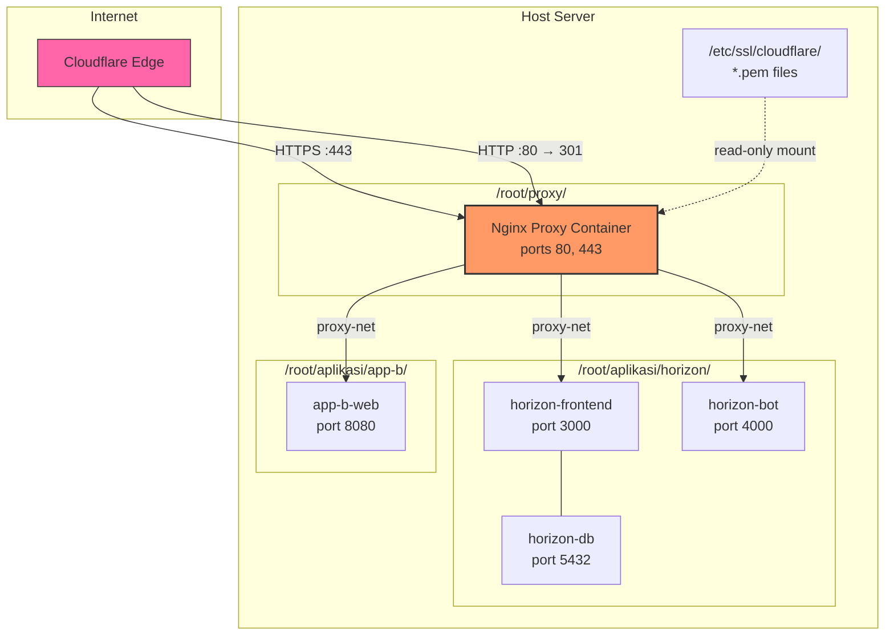
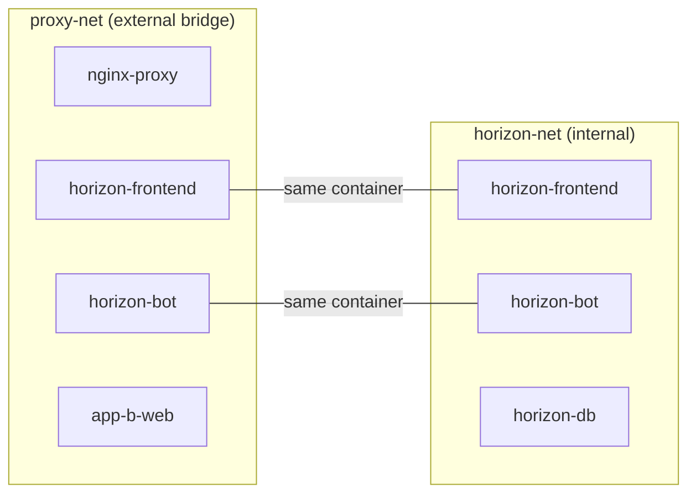

# Design Document: Host-Level Reverse Proxy

## Overview

This design introduces a standalone host-level Nginx reverse proxy that runs as its own Docker Compose project on the server, separate from any application stack. It replaces the per-app Nginx + Certbot pattern with a single entry point that terminates TLS using Cloudflare Origin Certificates and routes traffic to backend applications over an internal Docker network (`proxy-net`).

The proxy lives in its own directory (e.g., `/root/proxy/`) with a simple file structure: a `docker-compose.yml`, a main `nginx.conf`, a `sites/` directory containing one config file per domain, and SSL certificates mounted from the host filesystem.

The first migration target is the existing Horizon Trader Platform. After migration, Horizon's `nginx` and `certbot` containers are removed, and its `frontend` and `bot` services connect directly to `proxy-net`. Adding a new application behind the proxy requires only: (1) connecting the app to `proxy-net`, (2) dropping a site config file in `sites/`, and (3) reloading Nginx.

### Design Decisions

1. **Standalone Docker Compose project** — The proxy runs independently so it can be started/stopped/updated without affecting any application stack. This also means the proxy survives app redeployments.

2. **Cloudflare Origin Certificates over Let's Encrypt** — Since all domains are proxied through Cloudflare, Origin Certificates provide a simpler, zero-renewal SSL setup. Certificates are valid for up to 15 years and trusted by Cloudflare's edge in Full (Strict) mode.

3. **External Docker network (`proxy-net`)** — Using a pre-created external network avoids coupling between the proxy and app compose files. Both declare `proxy-net` as external, and Docker handles the routing.

4. **Per-site config files** — Each domain gets its own file in `sites/`. This keeps configs isolated, makes diffs clean, and allows adding/removing apps without touching shared configuration.

5. **Rate limiting in site configs** — Rate limit zones are defined in the main `nginx.conf` (shared across all sites), but the `limit_req` directives are applied per-location in each site config. This gives per-app control while sharing zone memory.

6. **HTTP 444 for unknown domains** — A default server block returns 444 (close connection) for requests that don't match any configured domain, preventing information leakage.

## Architecture



### Network Topology



Each app stack keeps its own internal network for database access and inter-service communication. Only the entry-point services (frontend, bot) also join `proxy-net` to receive traffic from the proxy.

## Components and Interfaces

### 1. Proxy Project Directory Structure

```
/root/proxy/
├── docker-compose.yml          # Proxy container definition
├── nginx.conf                  # Main Nginx config (http block, shared settings)
├── sites/
│   ├── _default.conf           # Default server block (returns 444)
│   ├── horizon.conf            # Horizon Trader Platform site config
│   └── example-template.conf   # Template for new apps (commented out)
├── deploy.sh                   # Deploy/setup script
└── README.md                   # Onboarding guide
```

### 2. Proxy Docker Compose Service

**File:** `/root/proxy/docker-compose.yml`

Single service definition:
- **Image:** `nginx:1.27-alpine`
- **Container name:** `nginx-proxy`
- **Ports:** `80:80`, `443:443`
- **Volumes:**
  - `./nginx.conf:/etc/nginx/nginx.conf:ro` — main config
  - `./sites/:/etc/nginx/conf.d/:ro` — per-site configs
  - `/etc/ssl/cloudflare/:/etc/ssl/cloudflare/:ro` — SSL certs
- **Network:** `proxy-net` (external)
- **Restart:** `unless-stopped`
- **Healthcheck:** `wget` to `http://localhost:80/health`

### 3. Main Nginx Configuration

**File:** `/root/proxy/nginx.conf`

Responsibilities:
- Worker process settings, logging, gzip compression
- Rate limit zone definitions (shared memory zones: `general`, `api`, `webhook`)
- `include /etc/nginx/conf.d/*.conf` to load all site configs

Rate limit zones are defined here with sensible defaults. Individual site configs reference these zones in their `limit_req` directives.

### 4. Default Server Block

**File:** `/root/proxy/sites/_default.conf`

- Listens on port 80 and 443 (with `default_server`)
- Port 80: redirects to HTTPS for known domains, returns 444 for unknown
- Port 443: returns 444 for any request without a matching `server_name`
- Provides a `/health` endpoint on port 80 for Docker healthcheck

### 5. Horizon Site Config

**File:** `/root/proxy/sites/horizon.conf`

- `server_name` set to the Horizon domain
- SSL termination with Cloudflare Origin Certificate
- Upstream blocks for `horizon-frontend` and `horizon-bot` (using container names on `proxy-net`)
- Location blocks preserving current routing:
  - `/api/bot/` and `/webhook/telegram` → `horizon-bot:4000`
  - `/_next/static/` → `horizon-frontend:3000` (1-year cache)
  - `/_next/image` → `horizon-frontend:3000` (30-day cache)
  - `/admin`, `/api/credit/`, `/api/articles/`, etc. → `horizon-frontend:3000`
  - `/` (default) → `horizon-frontend:3000`
- Rate limiting applied per-location using shared zones
- Security headers (X-Frame-Options, HSTS, etc.)

### 6. Site Config Template

**File:** `/root/proxy/sites/example-template.conf`

A commented-out template that administrators copy and customize. Contains placeholders for:
- `server_name`
- SSL certificate paths
- Upstream service name and port
- Location blocks

### 7. Deploy Script

**File:** `/root/proxy/deploy.sh`

Functions:
1. **Directory setup** — Creates `/etc/ssl/cloudflare/` if missing
2. **SSL validation** — Checks that certificate and key files exist; prints instructions if missing
3. **Network creation** — Creates `proxy-net` Docker network if it doesn't exist
4. **Container start** — Runs `docker-compose up -d --build`
5. **Health check** — Waits for container to become healthy, prints logs on failure
6. **Reload command** — `deploy.sh reload` sends `nginx -s reload` to the running container

### 8. Modified Horizon Docker Compose

Changes to `/root/aplikasi/horizon/docker-compose.yml`:
- **Remove:** `nginx` service entirely
- **Remove:** `certbot` service entirely
- **Remove:** All certbot volume mounts
- **Add:** `proxy-net` as an external network
- **Modify:** `frontend` service — add `proxy-net` to its networks
- **Modify:** `bot` service — add `proxy-net` to its networks
- **Keep:** `horizon-net` for internal DB communication
- **Keep:** All other services unchanged

### 9. Modified Horizon Deploy Script

Changes to `/root/aplikasi/horizon/deploy-docker.sh`:
- **Remove:** `generate_self_signed()` function
- **Remove:** `request_letsencrypt()` function
- **Remove:** `SSL_EMAIL` from required vars check
- **Remove:** `NGINX_HTTP_PORT` and `NGINX_HTTPS_PORT` from defaults
- **Remove:** certbot directory creation from `setup_directories()`
- **Remove:** nginx and certbot from health check
- **Update:** Health check to only verify `db`, `bot`, `frontend`
- **Update:** Post-deploy instructions to reference host proxy

## Data Models

### SSL Certificate File Layout

```
/etc/ssl/cloudflare/
├── example.com/
│   ├── cert.pem              # Cloudflare Origin Certificate
│   └── key.pem               # Private key
├── anotherdomain.com/
│   ├── cert.pem
│   └── key.pem
└── wildcard.example.com/     # Optional: wildcard cert
    ├── cert.pem
    └── key.pem
```

Each domain (or wildcard) gets its own subdirectory. Site configs reference these paths directly:
```nginx
ssl_certificate     /etc/ssl/cloudflare/example.com/cert.pem;
ssl_certificate_key /etc/ssl/cloudflare/example.com/key.pem;
```

### Proxy Environment Variables

The proxy itself needs minimal configuration. The `docker-compose.yml` does not use `.env` template substitution — all domain-specific settings live in the site config files. However, the deploy script accepts optional environment variables:

| Variable | Default | Description |
|---|---|---|
| `SSL_DIR` | `/etc/ssl/cloudflare` | Host path to SSL certificates |
| `PROXY_DIR` | `/root/proxy` | Proxy project directory |

### Horizon .env Changes

Variables **removed** from `.env.example`:
- `SSL_EMAIL` — no longer needed (no Let's Encrypt)
- `NGINX_HTTP_PORT` — proxy owns port 80
- `NGINX_HTTPS_PORT` — proxy owns port 443
- `NGINX_RATE_LIMIT_GENERAL` — moved to proxy config
- `NGINX_RATE_LIMIT_API` — moved to proxy config
- `NGINX_RATE_LIMIT_WEBHOOK` — moved to proxy config

Variables **unchanged**:
- `DOMAIN` — still needed by the app for constructing URLs
- `FRONTEND_PORT` — still used internally by the frontend container
- `BOT_PORT` — still used internally by the bot container
- All database, Telegram, R2, and admin variables remain as-is

### Site Config Data Structure

Each site config file follows this logical structure:

| Field | Example | Description |
|---|---|---|
| `server_name` | `horizon.example.com` | Domain this config handles |
| `ssl_certificate` | `/etc/ssl/cloudflare/example.com/cert.pem` | Path to origin cert |
| `ssl_certificate_key` | `/etc/ssl/cloudflare/example.com/key.pem` | Path to private key |
| Upstream(s) | `horizon-frontend:3000` | Container name + port on proxy-net |
| Location blocks | `/`, `/api/bot/`, etc. | Routing rules per path |
| Rate limits | `limit_req zone=api burst=20` | Per-location rate limiting |
| Cache headers | `Cache-Control: public, max-age=...` | Per-location caching |


## Error Handling

### Proxy Container Errors

| Scenario | Handling |
|---|---|
| Nginx config syntax error | `docker-compose up` fails; deploy script catches non-zero exit, prints `docker logs nginx-proxy`, exits with error |
| SSL certificate file missing | Nginx refuses to start; deploy script pre-validates cert files exist before starting container |
| SSL certificate expired/invalid | Nginx starts but Cloudflare rejects the connection (502 at edge). Admin must regenerate Origin Certificate in Cloudflare dashboard |
| Upstream app not running | Nginx returns 502 Bad Gateway to the client. The site config should include `proxy_connect_timeout` and `proxy_read_timeout` to fail fast |
| Unknown domain request | Default server block returns 444 (connection closed), no response body |

### Deploy Script Errors

| Scenario | Handling |
|---|---|
| SSL cert/key files missing | Script prints error with step-by-step instructions for generating a Cloudflare Origin Certificate, exits with code 1 |
| Docker not installed | Script checks for `docker` and `docker-compose` commands, prints install instructions if missing |
| `proxy-net` creation fails | Script prints Docker error, exits with code 1 |
| Container fails healthcheck | Script waits up to 60 seconds, then prints container logs and exits with code 1 |
| Port 80/443 already in use | Docker bind fails; script catches the error and suggests checking for conflicting services (e.g., Apache, existing Nginx) |

### Horizon Migration Errors

| Scenario | Handling |
|---|---|
| `proxy-net` doesn't exist yet | Horizon's `docker-compose up` fails because the external network is missing. The error message is clear: "network proxy-net declared as external, but could not be found". Admin must run the proxy deploy script first. |
| Proxy not running when Horizon starts | Horizon containers start fine (they don't depend on the proxy). Traffic just won't reach them until the proxy is up. No data loss risk. |
| Old nginx/certbot containers still running | Deploy script should `docker-compose down` the old stack before bringing up the new one. The old containers on ports 80/443 would conflict with the proxy. |

### Nginx Reload Errors

When `deploy.sh reload` is called:
1. Nginx tests the new config (`nginx -t`) before applying
2. If the config is invalid, the reload is rejected and the existing config continues serving traffic (zero downtime)
3. The script reports the validation error to the admin

## Testing Strategy

### Why Property-Based Testing Does Not Apply

This feature produces **infrastructure configuration** (Docker Compose YAML, Nginx config files, shell scripts) rather than application logic with input/output behavior. There are no pure functions, parsers, or data transformations to test with generated inputs. The appropriate testing strategies are smoke tests, integration tests, and manual validation.

### Smoke Tests

Verify the proxy starts and serves traffic correctly:

1. **Container starts healthy** — After `docker-compose up -d`, the `nginx-proxy` container reaches `healthy` status within 30 seconds
2. **Health endpoint responds** — `curl http://localhost/health` returns 200
3. **HTTP→HTTPS redirect** — `curl -I http://DOMAIN` returns 301 with `Location: https://DOMAIN/...`
4. **Unknown domain returns 444** — `curl -I https://SERVER_IP` gets connection closed (no response)
5. **SSL handshake succeeds** — `openssl s_client -connect DOMAIN:443` completes handshake with the Origin Certificate

### Integration Tests

Verify end-to-end routing after Horizon migration:

1. **Frontend routing** — `curl https://DOMAIN/` returns 200 from the Next.js frontend
2. **Bot API routing** — `curl https://DOMAIN/api/bot/status` returns 200 from the bot service
3. **Webhook routing** — `curl -X POST https://DOMAIN/webhook/telegram` reaches the bot service
4. **Admin routing** — `curl https://DOMAIN/admin` returns 200 (or redirect to login)
5. **Static asset caching** — `curl -I https://DOMAIN/_next/static/test.js` includes `Cache-Control: public, max-age=31536000, immutable`
6. **Image optimization caching** — `curl -I https://DOMAIN/_next/image?url=...` includes `Cache-Control: public, max-age=2592000`
7. **Security headers present** — Response includes `X-Frame-Options`, `X-Content-Type-Options`, `Strict-Transport-Security`
8. **Rate limiting active** — Rapid requests to `/api/bot/` eventually return 429

### Deploy Script Tests

Manual validation checklist:

1. **Fresh install** — Running `deploy.sh` on a clean server creates directories, network, and starts the container
2. **Missing SSL certs** — Running `deploy.sh` without certs prints clear error and instructions
3. **Reload** — Running `deploy.sh reload` applies config changes without dropping connections
4. **Failed config** — Placing an invalid site config and running `deploy.sh reload` keeps the old config active and reports the error
5. **Container failure** — If the container crashes, `deploy.sh` prints logs and exits non-zero

### Horizon Migration Validation

Manual validation checklist:

1. **Old containers removed** — `docker ps` shows no `horizon-nginx` or `horizon-certbot` containers
2. **New network connected** — `docker network inspect proxy-net` shows `horizon-frontend` and `horizon-bot`
3. **No exposed ports** — `docker ps` shows no port mappings for Horizon containers (only the proxy exposes 80/443)
4. **All existing routes work** — Every URL path that worked before migration still works after
5. **Database unaffected** — Data persists through the migration (no volume changes)
