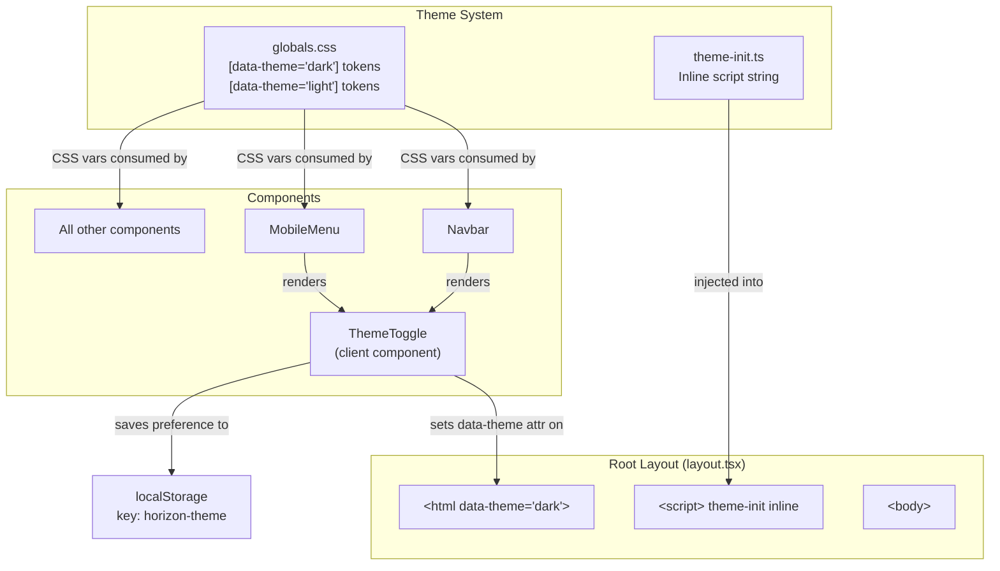

# Design Document: Modern UI Redesign

## Overview

This design transforms the Horizon Trader Platform frontend from a retro blogger aesthetic to a modern, professional dark/light dual-theme UI. The redesign is purely a presentation-layer change — no database, API, or routing modifications are needed.

The approach centers on **CSS custom properties scoped to `data-theme` attributes** on the `<html>` element. All existing color tokens in `globals.css` are replaced with theme-aware equivalents under `[data-theme="dark"]` and `[data-theme="light"]` selectors. A new `ThemeToggle` client component handles switching and persists the user's preference in `localStorage`. An inline script in the root layout prevents flash of wrong theme (FOWT) on page load.

### Key Design Decisions

1. **`data-theme` attribute on `<html>`** rather than CSS `prefers-color-scheme` media queries — gives explicit user control and simpler token scoping.
2. **CSS custom properties only** — no runtime JS for color values. The ThemeToggle only toggles the `data-theme` attribute; CSS handles the rest.
3. **Inline blocking script** for theme initialization — placed before any rendered content in `<head>` to read `localStorage` and set `data-theme` synchronously, preventing flash.
4. **No new dependencies** — the toggle uses a simple sun/moon SVG icon pair, no icon library needed.
5. **Component CSS modules unchanged in structure** — only token values and a few class names change. No component file restructuring.

## Architecture



### Theme Flow

1. **First visit (no stored preference):** Inline script finds no `localStorage` value → sets `data-theme="dark"` on `<html>` (default).
2. **Return visit:** Inline script reads `localStorage("horizon-theme")` → sets matching `data-theme` attribute before first paint.
3. **User toggles:** `ThemeToggle` component flips `data-theme` attribute on `document.documentElement`, updates `localStorage`.
4. **CSS reacts:** All components use `var(--color-*)` tokens which resolve differently under `[data-theme="dark"]` vs `[data-theme="light"]`.

## Components and Interfaces

### New Components

#### ThemeToggle

```typescript
// frontend/src/components/ui/ThemeToggle.tsx
'use client';

interface ThemeToggleProps {
  className?: string;  // Allow parent styling (Navbar vs MobileMenu placement)
}

export function ThemeToggle({ className }: ThemeToggleProps): JSX.Element;
```

**Behavior:**
- Reads current theme from `document.documentElement.getAttribute('data-theme')`
- On click: toggles between `"dark"` and `"light"`
- Updates `document.documentElement.setAttribute('data-theme', newTheme)`
- Persists to `localStorage.setItem('horizon-theme', newTheme)`
- Renders sun icon (☀) when dark mode is active (click to switch to light)
- Renders moon icon (🌙) when light mode is active (click to switch to dark)
- Icon transitions with a CSS rotation/opacity animation (0.3s)
- Minimum 44×44px touch target

#### Theme Initialization Script

```typescript
// frontend/src/lib/theme-init.ts
export const themeInitScript: string;
```

**Content (string to be injected as inline `<script>`):**
```javascript
(function() {
  var t = localStorage.getItem('horizon-theme');
  if (t === 'light' || t === 'dark') {
    document.documentElement.setAttribute('data-theme', t);
  } else {
    document.documentElement.setAttribute('data-theme', 'dark');
  }
})();
```

This script is injected into `layout.tsx` as a `<script dangerouslySetInnerHTML>` element inside `<head>` (or before `<body>` content) to execute synchronously before React hydration.

### Modified Components

#### Root Layout (`frontend/src/app/layout.tsx`)

Changes:
- Add `data-theme="dark"` as default attribute on `<html>` element
- Add inline `<script>` with theme initialization before `<body>` content
- Import and render nothing extra — the script handles pre-hydration

#### Navbar (`frontend/src/components/layout/Navbar.tsx`)

Changes:
- Import and render `<ThemeToggle />` between nav links and MobileMenu
- Pass `ThemeToggle` to MobileMenu as well (or MobileMenu imports its own)

#### MobileMenu (`frontend/src/components/layout/MobileMenu.tsx`)

Changes:
- Add `<ThemeToggle />` in the panel header area, next to the close button

### CSS Module Changes Summary

Every CSS module file is updated to replace hardcoded retro color references with the new theme-aware CSS custom property names. The token names stay the same (`--color-bg`, `--color-surface`, etc.) but their values differ per `data-theme` selector.

| Component | File | Key Changes |
|-----------|------|-------------|
| Global | `globals.css` | Replace `:root` tokens with `[data-theme]` scoped tokens; remove retro classes; update typography |
| Navbar | `Navbar.module.css` | Dark surface background, emerald logo, muted nav links |
| Footer | `Footer.module.css` | Dark background, emerald brand, muted links |
| Sidebar | `Sidebar.module.css` | Surface panels, remove retro-box refs, dark text colors |
| MobileMenu | `MobileMenu.module.css` | Surface panel, dark backdrop, emerald logo |
| ArticleCard | `ArticleCard.module.css` | Surface bg, emerald hover glow, solid borders |
| ArticleLongCard | `ArticleLongCard.module.css` | Same as ArticleCard conventions |
| OutlookCard | `OutlookCard.module.css` | Surface bg, emerald badge, solid borders |
| CategoryTabs | `CategoryTabs.module.css` | Transparent base, emerald active, muted inactive |
| GalleryGrid | `GalleryGrid.module.css` | Surface empty state |
| GalleryItem | `GalleryItem.module.css` | Surface bg, emerald hover border |
| Lightbox | `Lightbox.module.css` | Darker backdrop, emerald close hover |
| Pagination | `Pagination.module.css` | Surface buttons, emerald active, solid borders |
| SkeletonLoader | `SkeletonLoader.module.css` | Dark shimmer colors |
| ErrorPage | `ErrorPage.module.css` | Surface card, emerald code, dark details |
| Toast | `Toast.module.css` | Surface bg, emerald/danger/warning left border |
| Admin Layout | `layout.module.css` | Dark bg/surface, emerald accents |
| Admin Login | `page.module.css` | Dark bg, surface card, emerald button |
| ThemeToggle | `ThemeToggle.module.css` | **New file** — toggle button styling |

## Data Models

No data model changes. The only persisted data is a single `localStorage` key:

| Key | Type | Values | Default |
|-----|------|--------|---------|
| `horizon-theme` | `string` | `"dark"` \| `"light"` | Not set (defaults to `"dark"`) |

## Error Handling

| Scenario | Handling |
|----------|----------|
| `localStorage` unavailable (private browsing, disabled) | Theme init script catches silently, falls back to `data-theme="dark"`. ThemeToggle wraps `localStorage` calls in try/catch. |
| Invalid `localStorage` value (not `"dark"` or `"light"`) | Theme init script ignores invalid values, defaults to `"dark"`. |
| JavaScript disabled | `<html>` element has `data-theme="dark"` as static default attribute, so dark theme renders via CSS without JS. |
| SSR/hydration mismatch | Inline script runs before React hydration, so `data-theme` is already set. ThemeToggle reads from DOM on mount, not from React state initialization. |

## Testing Strategy

### Why Property-Based Testing Does Not Apply

This feature is a CSS/visual presentation redesign with a small client-side toggle component. There are no pure functions with meaningful input/output variation, no parsers, serializers, or data transformations. The changes are:
- CSS custom property value definitions (declarative configuration)
- CSS class updates (visual styling)
- A toggle component that flips a DOM attribute and writes to `localStorage`

These are best validated with example-based tests, snapshot tests, and manual visual review — not property-based testing.

### Unit Tests (Example-Based)

1. **ThemeToggle component:**
   - Renders without crashing
   - Displays sun icon when `data-theme="dark"` is active
   - Displays moon icon when `data-theme="light"` is active
   - Clicking toggles `data-theme` attribute on `<html>`
   - Clicking persists new theme to `localStorage`
   - Handles `localStorage` unavailability gracefully (no throw)
   - Has minimum 44×44px touch target (check rendered dimensions or CSS)

2. **Theme initialization script:**
   - Sets `data-theme="dark"` when no `localStorage` value exists
   - Sets `data-theme="dark"` when `localStorage` has `"dark"`
   - Sets `data-theme="light"` when `localStorage` has `"light"`
   - Defaults to `"dark"` when `localStorage` has an invalid value

### Snapshot / Visual Regression Tests

- Capture snapshots of key pages (Feed, Article, Gallery, Outlook, Admin Dashboard, Admin Login) in both dark and light themes
- Compare against baseline to catch unintended visual regressions

### Manual Testing Checklist

- Verify WCAG AA contrast ratios for all text/background combinations in both themes using browser DevTools or axe
- Verify no flash of wrong theme on page load (hard refresh with each theme preference)
- Verify theme persists across page navigations and browser restarts
- Verify all responsive breakpoints (320px, 768px, 1024px, 1920px) in both themes
- Verify keyboard navigation and focus outlines in both themes
- Verify admin dashboard matches public theme in both modes
- Verify all ARIA attributes remain intact on Lightbox, MobileMenu, Toast

### Integration Tests

- Full page render of Feed page in dark mode — no console errors, correct `data-theme` attribute
- Full page render of Feed page in light mode — no console errors, correct `data-theme` attribute
- Theme toggle round-trip: dark → light → dark preserves all styling correctly

### Test Framework

Use the existing project setup. If no test runner is configured, add `vitest` + `@testing-library/react` as the standard choice for Next.js + React 19 projects. No additional test dependencies beyond these.
