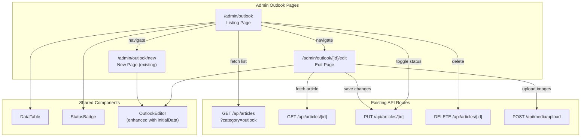

# Design Document: Outlook Admin CRUD

## Overview

This feature adds dedicated admin pages for managing Outlook (market analysis) articles, mirroring the existing Articles admin pattern. It introduces three new frontend routes — a listing page (`/admin/outlook`), an edit page (`/admin/outlook/[id]/edit`), and inline delete/status-toggle actions — all scoped to articles with `category = 'outlook'`.

No new backend API routes are needed. The existing `/api/articles` (GET with `category=outlook` filter), `/api/articles/[id]` (GET, PUT, DELETE), and `/api/media/upload` (POST) endpoints already support all required operations.

The implementation follows the established admin patterns:
- **Listing page**: Mirrors `articles/page.tsx` using the `DataTable` component with search, status filter, pagination, and row actions.
- **Edit page**: Mirrors `articles/[id]/edit/page.tsx` but uses `OutlookEditor` instead of `ArticleEditor`.
- **OutlookEditor enhancement**: Adds an optional `initialData` prop to support edit mode alongside the existing create mode.

### Key Design Decisions

1. **Reuse existing API routes** rather than creating outlook-specific endpoints. The articles API already supports `category` filtering, and outlook articles are stored in the same `articles` table.
2. **Follow the articles admin pattern exactly** for consistency — same DataTable usage, same CSS module approach, same page structure.
3. **Enhance OutlookEditor in-place** with an optional `initialData` prop rather than creating a separate edit component, keeping the component DRY.
4. **Hardcode `category=outlook`** in all API calls from the outlook admin pages so users never see non-outlook articles.

## Architecture



### Data Flow

1. **Listing Page**: On mount, fetches `GET /api/articles?category=outlook&page=1&pageSize=20`. Search and status filter params are appended dynamically. The response populates the `DataTable`.
2. **Status Toggle**: Calls `PUT /api/articles/[id]` with `{ status: newStatus }` where `newStatus` is `"hidden"` if currently published, or `"published"` otherwise. On success, re-fetches the list.
3. **Delete**: After `confirm()` dialog, calls `DELETE /api/articles/[id]`. On success, re-fetches the list.
4. **Edit Page**: On mount, fetches `GET /api/articles/[id]` to load article data. Passes `initialData` to `OutlookEditor`. On submit, uploads any new inline images via `/api/media/upload`, replaces blob URLs in content, then calls `PUT /api/articles/[id]`.

## Components and Interfaces

### 1. Outlook Listing Page

**File**: `frontend/src/app/admin/(dashboard)/outlook/page.tsx`

A client component (`'use client'`) that renders a `DataTable` of outlook articles. Follows the same structure as `articles/page.tsx`.

```typescript
// State
const [articles, setArticles] = useState<OutlookListItem[]>([]);
const [total, setTotal] = useState(0);
const [page, setPage] = useState(1);
const [search, setSearch] = useState('');
const [statusFilter, setStatusFilter] = useState('');
const [loading, setLoading] = useState(true);
```

**Key differences from articles page:**
- Always passes `category=outlook` to the API (hardcoded, not a user filter)
- No category filter dropdown (all items are outlook)
- No source column (all outlook articles come from dashboard)
- "New Outlook" button links to `/admin/outlook/new`
- Edit links point to `/admin/outlook/[id]/edit` instead of `/admin/articles/[id]/edit`
- Back links and redirects use `/admin/outlook` instead of `/admin/articles`

**Columns:**

| Key | Label | Render |
|-----|-------|--------|
| title | Judul | Link to `/admin/outlook/[id]/edit`, fallback "Tanpa judul" |
| status | Status | `StatusBadge` component |
| author | Penulis | `author_username` or "—" |
| media | Media | `📎 {count}` or "—" |
| created_at | Tanggal | Formatted date (id-ID locale) |
| actions | Aksi | Edit ✏️, Toggle 👁️/🔓, Delete 🗑️ buttons |

### 2. Outlook Edit Page

**File**: `frontend/src/app/admin/(dashboard)/outlook/[id]/edit/page.tsx`

A client component that loads an existing outlook article and renders it in the `OutlookEditor` with `initialData`. Follows the same structure as `articles/[id]/edit/page.tsx`.

```typescript
interface OutlookArticleData {
  id: string;
  title: string | null;
  content_html: string;
  status: string;
  slug: string;
  source: string;
  author_username: string | null;
  created_at: string;
}
```

**Flow:**
1. Extract `id` from route params via `useParams()`
2. Fetch `GET /api/articles/[id]` on mount
3. Pass loaded data as `initialData` to `OutlookEditor`
4. On submit: upload new inline images → replace blob URLs → `PUT /api/articles/[id]`
5. On success: redirect to `/admin/outlook`
6. On error: display error message, preserve form state

### 3. OutlookEditor Enhancement

**File**: `frontend/src/components/admin/OutlookEditor.tsx`

Add optional `initialData` and `submitLabel` props to support edit mode.

```typescript
export interface OutlookInitialData {
  title: string;
  content_html: string;
  status: string;
}

interface OutlookEditorProps {
  onSubmit: (data: OutlookFormData, images: InlineImageEntry[]) => Promise<void>;
  onCancel?: () => void;
  /** Optional initial data for edit mode */
  initialData?: OutlookInitialData;
  /** Submit button label (default: "Publikasikan") */
  submitLabel?: string;
  submitting?: boolean;
}
```

**Changes to existing component:**
- Initialize `title` state from `initialData?.title ?? ''`
- Initialize `contentHtml` state from `initialData?.content_html ?? ''`
- Initialize `status` state from `initialData?.status ?? 'published'`
- The `submitLabel` prop already exists and defaults to `'Publikasikan'`

These are the only changes needed — the rest of the component (toolbar, image handling, preview, validation, submit) works identically for both create and edit modes.

### 4. Outlook CSS Module

**File**: `frontend/src/app/admin/(dashboard)/outlook/outlook.module.css`

Reuses the same class names and styles as `articles/articles.module.css`. The outlook listing and edit pages import this module for consistent styling.

### 5. Updated Exports

**File**: `frontend/src/components/admin/index.ts`

Export the new `OutlookInitialData` type:

```typescript
export type { OutlookFormData, InlineImageEntry, OutlookInitialData } from './OutlookEditor';
```

## Data Models

### OutlookListItem (Client-side)

Used by the listing page to represent each row in the DataTable.

```typescript
interface OutlookListItem {
  id: string;
  title: string | null;
  status: string;           // 'published' | 'hidden' | 'draft'
  slug: string;
  author_username: string | null;
  media_count: number;
  created_at: string;       // ISO 8601
}
```

This is a subset of the `ArticleListItem` used in the articles page, minus `category` and `source` (which are always `'outlook'` and `'dashboard'` respectively).

### API Request/Response Shapes

All API shapes are already defined by the existing endpoints. No new shapes are needed.

**GET /api/articles?category=outlook** → `{ success: true, data: { articles: OutlookListItem[], total, page, pageSize } }`

**GET /api/articles/[id]** → `{ success: true, data: { article: ArticleData, media: MediaData[] } }`

**PUT /api/articles/[id]** → Body: `{ title?, content_html?, status? }` → `{ success: true, data: { article } }`

**DELETE /api/articles/[id]** → `{ success: true, data: { deleted: true } }`

### Status Toggle Logic

```typescript
function getNewStatus(currentStatus: string): string {
  return currentStatus === 'published' ? 'hidden' : 'published';
}
```

This maps:
- `'published'` → `'hidden'`
- `'hidden'` → `'published'`
- `'draft'` → `'published'`

## Correctness Properties

*A property is a characteristic or behavior that should hold true across all valid executions of a system — essentially, a formal statement about what the system should do. Properties serve as the bridge between human-readable specifications and machine-verifiable correctness guarantees.*

### Property 1: OutlookEditor initialData pre-population

*For any* valid `initialData` object containing a title string, a content_html string, and a status value from `{'published', 'hidden', 'draft'}`, when the OutlookEditor is rendered with that `initialData`, the title input field value SHALL equal `initialData.title`, the content textarea value SHALL equal `initialData.content_html`, and the status select value SHALL equal `initialData.status`.

**Validates: Requirements 6.1, 6.2, 6.3, 6.4, 2.2**

### Property 2: Status toggle correctness

*For any* article with a status value from `{'published', 'hidden', 'draft'}`, the status toggle function SHALL produce `'hidden'` when the current status is `'published'`, and SHALL produce `'published'` when the current status is `'hidden'` or `'draft'`.

**Validates: Requirements 4.2, 4.3**

## Error Handling

### Listing Page Errors

| Scenario | Handling |
|----------|----------|
| API fetch fails on load | Set `loading = false`, DataTable shows empty state. Silent failure matches articles page pattern. |
| Status toggle API fails | Silent failure (matches existing articles pattern). Future improvement: add toast notification. |
| Delete API fails | Display error via `alert()` or toast notification to inform the admin. |
| Session expired (401) | API returns 401; page shows empty data. Admin must re-login. |

### Edit Page Errors

| Scenario | Handling |
|----------|----------|
| Article not found (404) | Display "Artikel tidak ditemukan" error message with back link. |
| API fetch fails on load | Display "Gagal memuat artikel" error message. |
| Save fails (PUT error) | Display error message from API response. Form state is preserved (submitting flag reset, no redirect). |
| Image upload fails | The upload loop continues; failed images keep their blob URLs in content. The OutlookEditor's error state displays the message. |
| Validation error (422) | Display the validation message from the API (e.g., "Konten HTML tidak boleh kosong"). |

### OutlookEditor Errors

The existing error handling in OutlookEditor already covers:
- Empty title validation → "Judul artikel Outlook wajib diisi."
- Empty content validation → "Konten HTML tidak boleh kosong."
- Submit handler errors → Caught and displayed via the `error` state.

No changes to error handling are needed in the OutlookEditor.

## Testing Strategy

### Property-Based Tests

This feature has two testable properties suitable for property-based testing. Use `fast-check` as the PBT library (standard for TypeScript/React projects).

**Configuration:**
- Minimum 100 iterations per property test
- Tag format: `Feature: outlook-admin-crud, Property {number}: {property_text}`

**Property 1: OutlookEditor initialData pre-population**
- Generate random `{ title: string, content_html: string, status: 'published' | 'hidden' | 'draft' }` objects
- Render `OutlookEditor` with the generated `initialData`
- Assert each field's initial value matches the input
- Library: `fast-check` + `@testing-library/react`

**Property 2: Status toggle correctness**
- Generate random status values from `{'published', 'hidden', 'draft'}`
- Apply the toggle function
- Assert: `published` → `hidden`, everything else → `published`
- This is a pure function test, very fast to run

### Unit Tests (Example-Based)

| Test | Validates |
|------|-----------|
| Listing page renders DataTable with correct columns | Req 1.2 |
| Listing page calls API with `category=outlook` | Req 1.1 |
| Listing page shows "New Outlook" button linking to `/admin/outlook/new` | Req 1.5 |
| Listing page shows empty state when no articles | Req 1.7 |
| Status filter has correct options (all, published, hidden, draft) | Req 1.4 |
| Edit page shows error when article not found | Req 2.5 |
| Edit page preserves form state on save error | Req 2.6 |
| Edit page redirects to `/admin/outlook` on successful save | Req 2.7 |
| Delete shows confirmation dialog with article title | Req 3.2 |
| Delete refreshes list on success | Req 3.4 |
| Edit button navigates to `/admin/outlook/[id]/edit` | Req 5.2 |
| Title link navigates to `/admin/outlook/[id]/edit` | Req 5.3 |
| OutlookEditor renders without initialData (create mode) | Req 6.4 |
| OutlookEditor uses custom submitLabel | Req 6.5 |

### Integration Tests

| Test | Validates |
|------|-----------|
| Search input triggers API call with search param | Req 1.3 |
| Edit page submits PUT request with updated data | Req 2.3 |
| Edit page uploads images and replaces blob URLs | Req 2.4 |
| Delete button sends DELETE request after confirmation | Req 3.3 |
| Status toggle sends PUT with correct new status | Req 4.2, 4.3 |

### Edge Case Tests

| Test | Validates |
|------|-----------|
| Delete API error shows notification | Req 3.5 |
| Edit page handles API error on save without losing content | Req 2.6 |
| Article with null title displays "Tanpa judul" fallback | Req 1.2 |
| Pagination with exactly 20 items shows single page | Req 1.6 |
