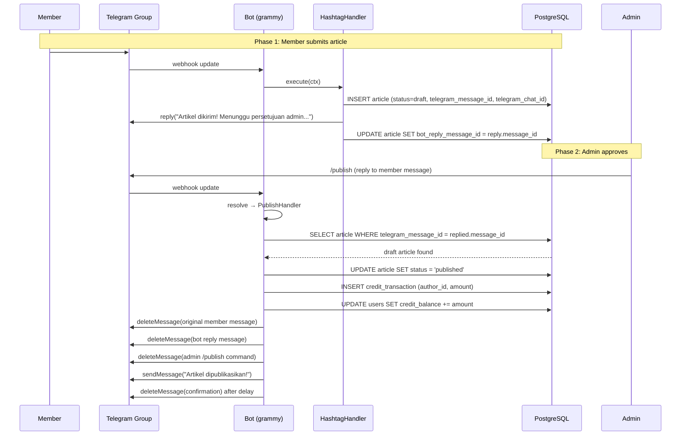
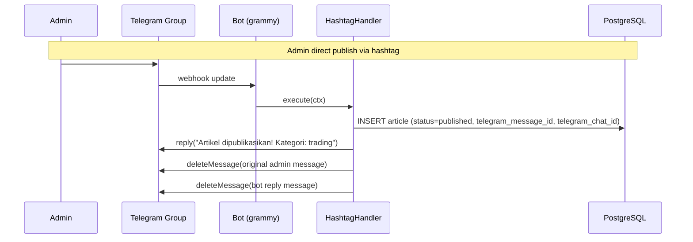

# Design Document: Publish Approval Flow

## Overview

This feature transforms the `/publish` command from creating new articles to approving existing draft articles, adds Telegram message ID tracking to the articles table, and implements message cleanup after publication. The changes span four layers: database schema, BotContext interface, HashtagHandler, and PublishHandler.

**Current behavior:**
- HashtagHandler creates draft articles for members, published articles for admins
- PublishHandler creates a *new* article from any replied-to message (incorrect)
- Published messages remain in the Telegram group indefinitely

**Target behavior:**
- HashtagHandler stores Telegram message IDs (original, bot reply, chat) on article creation
- PublishHandler looks up an existing draft article by `telegram_message_id` and transitions it to `published`
- After publication, the original message, bot reply, and admin command are deleted from the group
- Admin direct publishes (via hashtag) also clean up messages

## Architecture

The feature modifies four existing components and adds one database migration. No new services or modules are introduced.





## Components and Interfaces

### 1. BotContext (bot/src/middleware/types.ts)

Two new methods are added to the `BotContext` interface to expose Telegram Bot API operations to handlers without requiring direct access to the bot instance.

```typescript
export interface BotContext {
  // ... existing fields ...
  message: TelegramMessage;
  user: User;
  reply(text: string): Promise<void>;
  replyWithError(error: AppError): Promise<void>;

  // NEW: returns the sent message's message_id for tracking
  replyWithMessageId(text: string): Promise<number>;

  // NEW: delete a message in any chat (best-effort, never throws)
  deleteMessage(chatId: number, messageId: number): Promise<void>;

  // NEW: send a message to any chat, returns the sent message_id
  sendMessage(chatId: number, text: string): Promise<number>;
}
```

**Design decisions:**
- `deleteMessage` is best-effort: it catches all errors and logs them. This prevents message cleanup failures from breaking the publish flow.
- `replyWithMessageId` is added so HashtagHandler can capture the bot's reply `message_id` to store in `bot_reply_message_id`. The existing `reply()` method returns `void` and cannot be changed without breaking other callers.
- `sendMessage` is needed for the PublishHandler to send a confirmation to the group chat (not just reply to the admin's message).

### 2. BotContext wiring (bot/src/index.ts)

The BotContext construction in the `bot.on('message')` handler is updated to wire the new methods:

```typescript
const botCtx: BotContext = {
  // ... existing fields ...
  replyWithMessageId: async (text: string): Promise<number> => {
    const sent = await ctx.reply(text);
    return sent.message_id;
  },
  deleteMessage: async (chatId: number, messageId: number): Promise<void> => {
    try {
      await bot.api.deleteMessage(chatId, messageId);
    } catch (err) {
      console.error(`[Bot] Failed to delete message ${messageId} in chat ${chatId}:`, err);
    }
  },
  sendMessage: async (chatId: number, text: string): Promise<number> => {
    const sent = await bot.api.sendMessage(chatId, text);
    return sent.message_id;
  },
};
```

### 3. HashtagHandler (bot/src/handlers/hashtagHandler.ts)

**Changes:**
- `insertArticle` dependency signature gains three optional fields: `telegram_message_id`, `bot_reply_message_id`, `telegram_chat_id`
- After the transaction, the handler calls `ctx.replyWithMessageId()` instead of `ctx.reply()` to capture the reply's `message_id`
- For member drafts: stores `telegram_message_id`, `telegram_chat_id` in the insert, then updates `bot_reply_message_id` after the reply is sent
- For admin publishes: stores `telegram_message_id`, `telegram_chat_id` in the insert, then performs message cleanup (delete original + bot reply)
- A new dependency `updateArticleReplyMessageId` is added to update the `bot_reply_message_id` after the reply is sent (since the reply happens after the transaction)

**Updated HashtagHandlerDeps:**

```typescript
export interface HashtagHandlerDeps {
  // ... existing deps ...

  /** Update the bot_reply_message_id on an article after the reply is sent */
  updateArticleReplyMessageId: (
    articleId: string,
    botReplyMessageId: number,
  ) => Promise<void>;
}
```

**Flow for member draft:**
1. Insert article with `telegram_message_id` and `telegram_chat_id` (inside transaction)
2. Award credits if admin (existing logic)
3. After transaction: call `ctx.replyWithMessageId()` to get reply `message_id`
4. Call `updateArticleReplyMessageId(article.id, replyMessageId)` to store it
5. For admin: delete original message and bot reply (best-effort)

### 4. PublishHandler (bot/src/handlers/publishHandler.ts)

**Complete rewrite.** The handler no longer creates articles. Instead:

**Updated PublishHandlerDeps:**

```typescript
export interface PublishHandlerDeps {
  /** Find an article by its Telegram message ID */
  findArticleByMessageId: (
    telegramMessageId: number,
  ) => Promise<{
    id: string;
    author_id: string;
    category: ArticleCategory;
    status: string;
    telegram_message_id: number | null;
    bot_reply_message_id: number | null;
    telegram_chat_id: number | null;
  } | null>;

  /** Run a callback inside a database transaction */
  withTransaction: <T>(fn: (client: DbClient) => Promise<T>) => Promise<T>;

  /** Update article status */
  updateArticleStatus: (
    articleId: string,
    status: string,
    client: DbClient,
  ) => Promise<void>;

  /** Look up the credit reward for a category */
  getCreditReward: (
    category: string,
    client: DbClient,
  ) => Promise<{ credit_reward: number; is_active: boolean } | null>;

  /** Insert a credit transaction record */
  insertCreditTransaction: (
    data: {
      user_id: string;
      amount: number;
      transaction_type: string;
      source_type: string;
      source_id: string;
      description: string | null;
    },
    client: DbClient,
  ) => Promise<void>;

  /** Update the user's credit balance atomically */
  updateCreditBalance: (
    userId: string,
    amount: number,
    client: DbClient,
  ) => Promise<void>;
}
```

**Flow:**
1. Check `ctx.user.role === 'admin'` → reject non-admins
2. Check `ctx.message.reply_to_message` exists → reject if missing
3. Call `findArticleByMessageId(reply_to_message.message_id)` → reject if not found ("Pesan ini bukan artikel draft")
4. Check `article.status === 'draft'` → reject if not draft ("Artikel sudah dipublikasikan")
5. Inside transaction:
   a. `updateArticleStatus(article.id, 'published')`
   b. Award credits to `article.author_id` (not `ctx.user.id`)
6. Message cleanup (all best-effort):
   a. Delete original member message (`article.telegram_message_id`, `article.telegram_chat_id`)
   b. Delete bot reply (`article.bot_reply_message_id`, `article.telegram_chat_id`)
   c. Delete admin's `/publish` command (`ctx.message.message_id`, `ctx.message.chat.id`)
7. Send confirmation message, then delete it after a short delay (~5 seconds)

### 5. Database migration wiring (bot/src/index.ts)

The `insertArticle` function in `index.ts` is updated to accept and pass through the new columns:

```typescript
async function insertArticle(
  data: {
    author_id: string;
    content_html: string;
    title: string | null;
    category: string;
    source: string;
    status: string;
    slug: string;
    telegram_message_id?: number | null;
    bot_reply_message_id?: number | null;
    telegram_chat_id?: number | null;
  },
  client: DbClient,
): Promise<{ id: string }> {
  const result = await queryOne<{ id: string }>(
    `INSERT INTO articles (author_id, content_html, title, category, source, status, slug,
       telegram_message_id, bot_reply_message_id, telegram_chat_id)
     VALUES ($1, $2, $3, $4, $5, $6, $7, $8, $9, $10)
     RETURNING id`,
    [data.author_id, data.content_html, data.title, data.category, data.source,
     data.status, data.slug,
     data.telegram_message_id ?? null, data.bot_reply_message_id ?? null, data.telegram_chat_id ?? null],
    client,
  );
  if (!result) throw new Error('Failed to insert article');
  return result;
}
```

New functions added to `index.ts`:

```typescript
async function findArticleByMessageId(telegramMessageId: number) {
  return queryOne<{
    id: string; author_id: string; category: ArticleCategory; status: string;
    telegram_message_id: number | null; bot_reply_message_id: number | null;
    telegram_chat_id: number | null;
  }>(
    `SELECT id, author_id, category, status, telegram_message_id, bot_reply_message_id, telegram_chat_id
     FROM articles WHERE telegram_message_id = $1`,
    [telegramMessageId],
  );
}

async function updateArticleStatus(articleId: string, status: string, client: DbClient) {
  await execute('UPDATE articles SET status = $1 WHERE id = $2', [status, articleId], client);
}

async function updateArticleReplyMessageId(articleId: string, botReplyMessageId: number) {
  await execute(
    'UPDATE articles SET bot_reply_message_id = $1 WHERE id = $2',
    [botReplyMessageId, articleId],
  );
}
```

## Data Models

### Database Migration: 004_add_telegram_message_tracking.sql

```sql
-- ============================================
-- Horizon Trader Platform — Schema Update
-- Migration 004: Add Telegram message tracking columns to articles
-- ============================================

-- Store the original Telegram message ID for article lookup during /publish
ALTER TABLE articles ADD COLUMN IF NOT EXISTS telegram_message_id BIGINT;

-- Store the bot's reply message ID for cleanup after publication
ALTER TABLE articles ADD COLUMN IF NOT EXISTS bot_reply_message_id BIGINT;

-- Store the Telegram chat ID for message deletion API calls
ALTER TABLE articles ADD COLUMN IF NOT EXISTS telegram_chat_id BIGINT;

-- Index for efficient lookup by telegram_message_id (used by /publish)
CREATE INDEX IF NOT EXISTS idx_articles_telegram_message_id ON articles(telegram_message_id);
```

### Updated Article Entity (shared/types/index.ts)

```typescript
export interface Article {
  id: string;
  author_id: string;
  content_html: string;
  title: string | null;
  category: ArticleCategory;
  source: ArticleSource;
  status: ArticleStatus;
  slug: string;
  created_at: Date;
  // NEW: Telegram message tracking
  telegram_message_id: number | null;
  bot_reply_message_id: number | null;
  telegram_chat_id: number | null;
}
```

### Data Flow Summary

| Field | Set by | When | Used by |
|---|---|---|---|
| `telegram_message_id` | HashtagHandler | Article insert (both member draft and admin publish) | PublishHandler lookup |
| `bot_reply_message_id` | HashtagHandler | After reply is sent (member drafts only; admin publishes delete reply immediately) | PublishHandler cleanup |
| `telegram_chat_id` | HashtagHandler | Article insert (both member draft and admin publish) | PublishHandler cleanup, HashtagHandler cleanup |

## Correctness Properties

*A property is a characteristic or behavior that should hold true across all valid executions of a system — essentially, a formal statement about what the system should do. Properties serve as the bridge between human-readable specifications and machine-verifiable correctness guarantees.*

### Property 1: Member draft article stores all Telegram IDs

*For any* member user and any valid hashtag message with any `message_id` and `chat.id`, when the HashtagHandler creates a draft article, the resulting article record SHALL contain the original `message_id` as `telegram_message_id`, the bot reply's `message_id` as `bot_reply_message_id`, and the `chat.id` as `telegram_chat_id`.

**Validates: Requirements 1.4, 1.5, 1.6, 8.2**

### Property 2: Admin publish article stores Telegram IDs

*For any* admin user and any valid hashtag message with any `message_id` and `chat.id`, when the HashtagHandler creates a published article, the resulting article record SHALL contain the original `message_id` as `telegram_message_id` and the `chat.id` as `telegram_chat_id`.

**Validates: Requirements 1.7, 1.8**

### Property 3: Draft approval updates existing article without creating new ones

*For any* draft article in the database and any admin user replying to the original message with `/publish`, the PublishHandler SHALL update the existing article's status to `published` and SHALL NOT call `insertArticle`.

**Validates: Requirements 2.4, 2.5**

### Property 4: Credits awarded to original author with category-based amount

*For any* draft article with any `author_id` and any `category`, when an admin approves it via `/publish`, the credit transaction SHALL reference the article's `author_id` (not the admin's user ID) and the credit amount SHALL match the `credit_reward` from `credit_settings` for that category.

**Validates: Requirements 3.1, 3.2, 3.4**

### Property 5: Draft approval deletes all three messages

*For any* draft article with stored `telegram_message_id`, `bot_reply_message_id`, and `telegram_chat_id`, when an admin approves it, the PublishHandler SHALL call `deleteMessage` for: (1) the original member message, (2) the bot reply message, and (3) the admin's `/publish` command message.

**Validates: Requirements 4.1, 4.2, 4.3**

### Property 6: Message deletion failures do not interrupt processing

*For any* message deletion that throws an error (message already deleted, too old, insufficient permissions), the handler SHALL complete successfully — the article status update and credit award SHALL still be committed.

**Validates: Requirements 4.5, 5.3, 6.5**

### Property 7: Admin direct publish cleans up messages

*For any* admin user publishing an article directly via hashtag, the HashtagHandler SHALL call `deleteMessage` for both the original admin message and the bot's reply message.

**Validates: Requirements 5.1, 5.2**

### Property 8: Reply messages include correct category

*For any* article creation via hashtag, the bot's reply message SHALL contain the article's category name. For member drafts, the reply SHALL indicate "Menunggu persetujuan admin". For admin publishes, the reply SHALL indicate "dipublikasikan".

**Validates: Requirements 8.1, 8.3**

## Error Handling

### Message Deletion Errors

All message deletion calls are best-effort. The `BotContext.deleteMessage` method wraps `bot.api.deleteMessage` in a try/catch that logs the error and returns silently. Common failure scenarios:

| Scenario | Telegram API Error | Handling |
|---|---|---|
| Message already deleted | "Bad Request: message to delete not found" | Logged, ignored |
| Message too old (>48h) | "Bad Request: message can't be deleted" | Logged, ignored |
| Bot lacks delete permission | "Bad Request: not enough rights" | Logged, ignored |
| Network timeout | ETIMEDOUT / ECONNREFUSED | Logged, ignored |

This ensures the publish flow always completes even if cleanup fails.

### Article Lookup Errors

- **No article found for message**: PublishHandler replies "Pesan ini bukan artikel draft" — this covers messages that were never processed by HashtagHandler (e.g., plain text, messages from before the feature was deployed).
- **Article found but not draft**: PublishHandler replies "Artikel sudah dipublikasikan" — prevents double-publishing.

### Transaction Errors

The status update and credit award happen inside a single database transaction. If any step fails, the entire transaction rolls back — the article remains a draft and no credits are awarded. The handler replies with a generic error message.

### Confirmation Auto-Delete

The confirmation message sent after approval is deleted after a ~5 second delay using `setTimeout`. If the deletion fails, it is silently ignored. The delay uses a fire-and-forget pattern (no `await`) so it doesn't block the handler response.

```typescript
// Fire-and-forget: delete confirmation after delay
const confirmationId = await ctx.sendMessage(chatId, 'Artikel berhasil dipublikasikan!');
setTimeout(async () => {
  await ctx.deleteMessage(chatId, confirmationId);
}, 5000);
```

## Testing Strategy

### Property-Based Tests (fast-check)

The project uses TypeScript. Property-based tests will use [fast-check](https://github.com/dubettier/fast-check) with a minimum of 100 iterations per property.

**Test structure:** Each property test creates arbitrary inputs (message IDs, chat IDs, user roles, article categories, credit settings) and verifies the handler behavior through mocked dependencies.

**Generators needed:**
- `arbMessageId`: arbitrary positive integers for Telegram message IDs
- `arbChatId`: arbitrary negative integers for Telegram group chat IDs (groups use negative IDs)
- `arbCategory`: one of `'trading' | 'life_story' | 'general'`
- `arbBotContext`: arbitrary BotContext with configurable user role, message IDs, and chat ID
- `arbDraftArticle`: arbitrary article record with `status: 'draft'` and random Telegram IDs
- `arbCreditSettings`: arbitrary `{ credit_reward: number, is_active: boolean }`

**Property test configuration:**
- Minimum 100 iterations per property
- Each test tagged with: `Feature: publish-approval-flow, Property {N}: {title}`

### Unit Tests (example-based)

| Test | Validates |
|---|---|
| PublishHandler rejects non-admin users | Req 2.6 |
| PublishHandler rejects missing reply_to_message | Req 2.7 |
| PublishHandler replies "Pesan ini bukan artikel draft" when no article found | Req 2.2 |
| PublishHandler replies "Artikel sudah dipublikasikan" when article is not draft | Req 2.3 |
| Credits not awarded when credit_reward is 0 | Req 3.3 |
| Credits not awarded when is_active is false | Req 3.3 |
| Confirmation message is sent and auto-deleted | Req 4.4 |

### Integration / Smoke Tests

| Test | Validates |
|---|---|
| Migration 004 adds all three columns with correct types | Req 7.1, 7.2, 7.3 |
| Migration 004 creates index on telegram_message_id | Req 7.4 |
| Migration file is numbered 004 | Req 7.5 |
| BotContext.deleteMessage delegates to bot.api.deleteMessage | Req 6.3 |
| BotContext.sendMessage delegates to bot.api.sendMessage | Req 6.4 |
