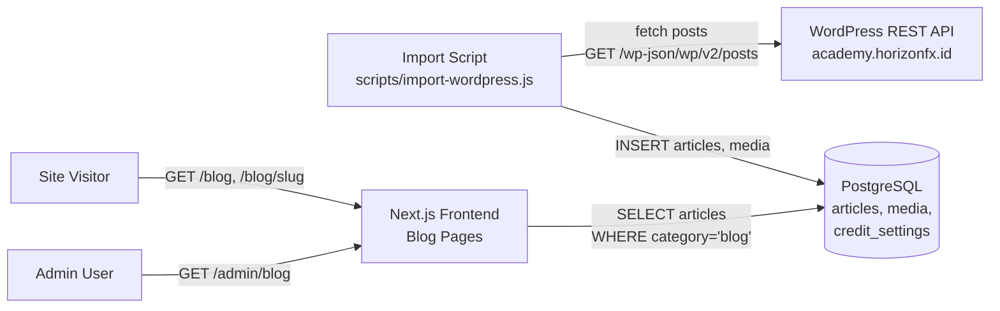
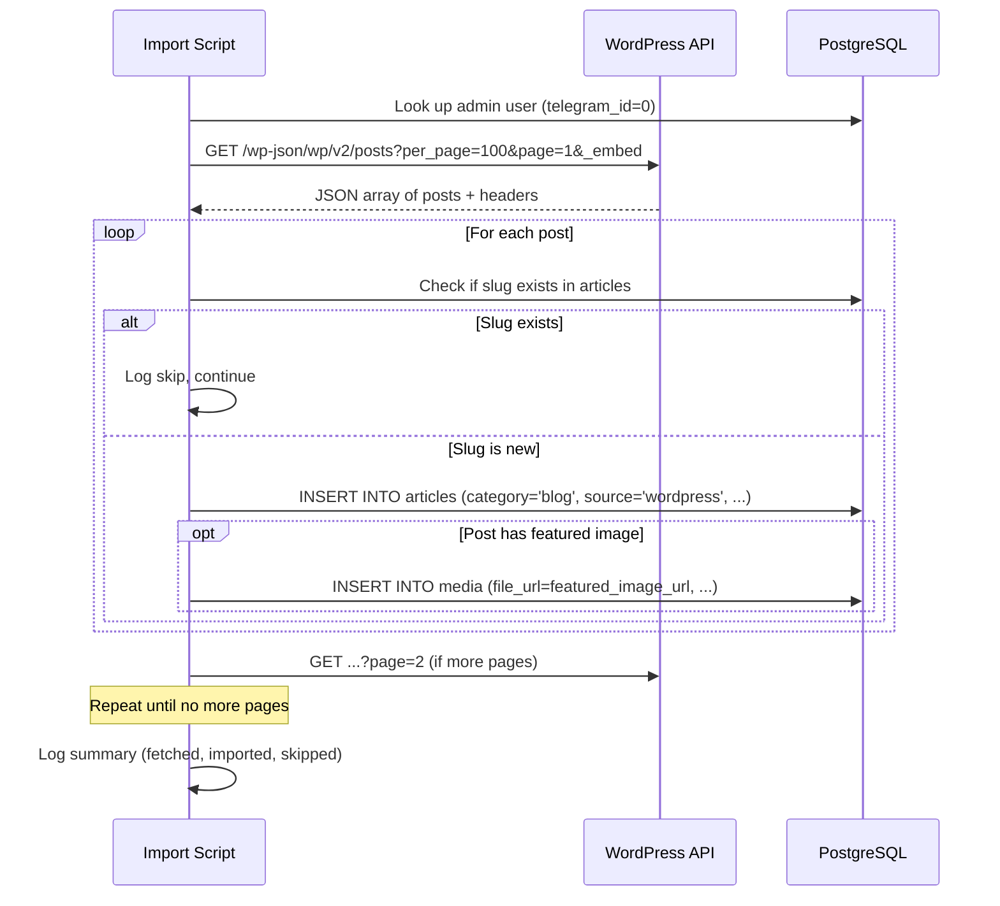
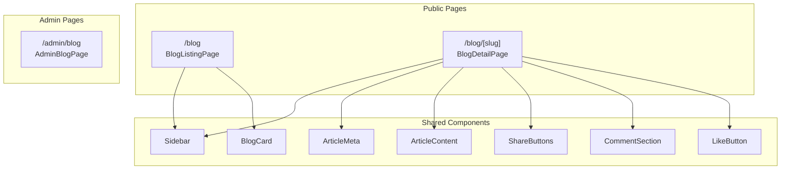

# Design Document: WordPress Blog Import

## Overview

This feature integrates WordPress blog content from `academy.horizonfx.id` into the Horizon Trader Platform. It introduces:

1. A new `blog` article category and `wordpress` article source in the type system and database
2. A standalone Node.js import script (`scripts/import-wordpress.js`) that fetches posts via the WordPress REST API and inserts them into the existing `articles` table
3. Public blog listing (`/blog`) and detail (`/blog/[slug]`) pages following the established Outlook page pattern
4. Navigation updates (Navbar and Admin Sidebar) to surface blog content
5. Next.js image/CSP configuration to allow WordPress-hosted images

The design reuses existing components (Sidebar, ArticleMeta, ArticleContent, ShareButtons, CommentSection, LikeButton) and follows the same data access patterns (direct `@shared/db` queries in server components) used by the Outlook pages.

## Architecture

### System Context



### Data Flow — Import Process



### Page Architecture



## Components and Interfaces

### 1. Type System Updates

**File: `shared/types/index.ts`**

Add `BLOG` to `ArticleCategory` and `WORDPRESS` to `ArticleSource`:

```typescript
export const ArticleCategory = {
  TRADING: 'trading',
  LIFE_STORY: 'life_story',
  GENERAL: 'general',
  OUTLOOK: 'outlook',
  BLOG: 'blog',           // NEW
} as const;

export const ArticleSource = {
  TELEGRAM: 'telegram',
  DASHBOARD: 'dashboard',
  WORDPRESS: 'wordpress',  // NEW
} as const;
```

**File: `shared/constants.ts`**

```typescript
export const VALID_CATEGORIES = ['trading', 'life_story', 'general', 'outlook', 'blog'] as const;
```

Add blog pagination constant:

```typescript
export const PAGINATION = {
  // ... existing
  BLOG_PAGE_SIZE: 12,
} as const;
```

**File: `frontend/src/components/article/ArticleMeta.tsx`**

Add blog label to `categoryLabels`:

```typescript
const categoryLabels: Record<string, string> = {
  trading: 'Trading Room',
  life_story: 'Life & Coffee',
  general: 'General',
  outlook: 'Outlook',
  blog: 'Blog',  // NEW
};
```

### 2. Import Script

**File: `scripts/import-wordpress.js`**

A standalone Node.js script that:
- Connects to PostgreSQL using `DATABASE_URL` environment variable (or individual `POSTGRES_*` vars)
- Fetches all published posts from `https://academy.horizonfx.id/wp-json/wp/v2/posts?per_page=100&_embed`
- Paginates using the `X-WP-TotalPages` response header
- For each post, extracts fields and inserts into `articles` table
- Skips posts whose slug already exists in the database
- Stores featured image URLs in the `media` table
- Uses the admin user (telegram_id=0) as `author_id`
- Does NOT create credit transactions

**Key function — WordPress post extraction:**

```typescript
interface WordPressPost {
  id: number;
  title: { rendered: string };
  content: { rendered: string };
  excerpt: { rendered: string };
  slug: string;
  date: string;
  _embedded?: {
    'wp:featuredmedia'?: Array<{
      source_url: string;
      media_type: string;
    }>;
  };
}

interface ExtractedPost {
  title: string;
  contentHtml: string;
  excerpt: string;
  slug: string;
  date: string;
  featuredImageUrl: string | null;
}

function extractPostData(post: WordPressPost): ExtractedPost {
  const featuredMedia = post._embedded?.['wp:featuredmedia']?.[0];
  return {
    title: post.title.rendered,
    contentHtml: post.content.rendered,
    excerpt: post.excerpt.rendered,
    slug: post.slug,
    date: post.date,
    featuredImageUrl: featuredMedia?.source_url ?? null,
  };
}
```

**Script flow:**

```javascript
async function main() {
  // 1. Connect to database
  // 2. Look up admin user ID (telegram_id = 0)
  // 3. Fetch all pages from WordPress API
  // 4. For each post:
  //    a. Check if slug exists → skip if duplicate
  //    b. INSERT into articles with category='blog', source='wordpress'
  //    c. If featured image exists → INSERT into media
  // 5. Log summary
  // 6. Close database connection
}
```

**Error handling:**
- HTTP errors from WordPress API → log error, exit with code 1
- Individual DB insert failures → log error for that post, continue with remaining posts
- Database connection failure → log error, exit with code 1

### 3. Next.js Configuration Updates

**File: `frontend/next.config.mjs`**

Add `academy.horizonfx.id` to:
- `images.remotePatterns` — allows Next.js `<Image>` optimization (though we use `` tags for WordPress content)
- CSP `img-src` directive — allows browser to load images from WordPress
- CSP `media-src` directive — allows browser to load media from WordPress

### 4. BlogCard Component

**File: `frontend/src/components/blog/BlogCard.tsx`**

Follows the same pattern as `OutlookCard`. Displays:
- Featured image thumbnail (or placeholder icon 📝)
- "Blog" badge
- Publication date
- Title (linked to `/blog/[slug]`)
- Excerpt (first 200 chars of plain text)
- Author name and estimated read time

```typescript
export interface BlogCardData {
  id: string;
  title: string | null;
  content_html: string;
  slug: string;
  created_at: string;
  author_name: string | null;
  cover_image: string | null;
}

interface BlogCardProps {
  article: BlogCardData;
}
```

### 5. Blog Listing Page

**File: `frontend/src/app/blog/page.tsx`**

Server component that:
- Queries `articles` table filtered by `category='blog'` and `status='published'`
- Orders by `created_at DESC`
- Supports server-side pagination via search params (`?page=1`)
- Supports search filtering via search params (`?search=keyword`)
- Renders `BlogCard` for each article
- Includes `Sidebar` component
- Exports SEO metadata (title, description, canonical URL)
- Shows empty state when no articles exist

**Layout:** Same flex layout as Outlook page — content area + Sidebar.

**Pagination:** Client-side pagination component that updates URL search params. Page size: 12 articles per page.

**Search:** Client-side search input that updates URL search params, triggering server re-render.

### 6. Blog Detail Page

**File: `frontend/src/app/blog/[slug]/page.tsx`**

Server component following the Outlook detail page pattern:
- Queries article by slug with `category='blog'` and `status='published'`
- Fetches associated media, comment count, and like count
- Renders: back link → title → ArticleMeta → featured image → ArticleContent → stats → ShareButtons → CommentSection
- Includes JSON-LD structured data (Article schema)
- Exports `generateMetadata` for OG/Twitter Card
- Exports `generateStaticParams` for SSG of recent blog articles
- Uses ISR with 5-minute revalidation (`revalidate = 300`)
- Returns 404 via `notFound()` for invalid slugs

### 7. Navbar Update

**File: `frontend/src/components/layout/Navbar.tsx`**

Add `{ label: 'Blog', href: '/blog' }` to `navItems` array between Outlook and Gallery:

```typescript
const navItems = [
  { label: 'Feed', href: '/' },
  { label: 'Outlook', href: '/outlook' },
  { label: 'Blog', href: '/blog' },      // NEW
  { label: 'Gallery', href: '/gallery' },
] as const;
```

### 8. Admin Sidebar Update

**File: `frontend/src/app/admin/(dashboard)/AdminSidebar.tsx`**

Add Blog to the "Utama" section after Outlook:

```typescript
{
  label: 'Utama',
  items: [
    { label: 'Dashboard', href: '/admin', icon: '📊' },
    { label: 'Articles', href: '/admin/articles', icon: '📝' },
    { label: 'Outlook', href: '/admin/outlook', icon: '📈' },
    { label: 'Blog', href: '/admin/blog', icon: '📰' },  // NEW
  ],
},
```

### 9. Admin Blog Page

**File: `frontend/src/app/admin/(dashboard)/blog/page.tsx`**

Client component following the same pattern as `AdminOutlookPage`:
- Fetches articles from `/api/articles?category=blog` with pagination, search, and status filter
- DataTable with columns: title, status, author, media count, date, actions
- Actions: edit (reuses existing article edit page), toggle status, delete
- No "New Blog" button (blog articles come from WordPress import only)

### 10. Sidebar Update

**File: `frontend/src/components/layout/Sidebar.tsx`**

Add Blog to the categories list:

```typescript
const categories = [
  { label: 'Semua', href: '/' },
  { label: 'Trading Room', href: '/?category=trading' },
  { label: 'Life & Coffee', href: '/?category=life_story' },
  { label: 'Outlook', href: '/outlook' },
  { label: 'Blog', href: '/blog' },      // NEW
  { label: 'Gallery', href: '/gallery' },
] as const;
```

### 11. Database Migration

**File: `db/migrations/006_add_blog_category.sql`**

```sql
-- Add credit settings for blog category (0 credits, active)
INSERT INTO credit_settings (category, credit_reward, is_active)
VALUES ('blog', 0, true)
ON CONFLICT (category) DO NOTHING;
```

No schema changes needed — the `articles.category` column is `VARCHAR(50)` without a CHECK constraint, so `'blog'` is already accepted. The `articles.source` column is also `VARCHAR(50)` and accepts `'wordpress'`.

### 12. API Route Update

**File: `frontend/src/app/api/articles/route.ts`** and **`frontend/src/app/api/articles/[id]/route.ts`**

Update the `validCategories` arrays to include `'blog'`:

```typescript
const validCategories = ['trading', 'life_story', 'general', 'outlook', 'blog'];
```

## Data Models

### Articles Table (existing — no schema change)

| Column | Type | Notes |
|--------|------|-------|
| id | UUID | Primary key |
| author_id | UUID | FK → users.id (admin user for imports) |
| content_html | TEXT | WordPress `content.rendered` |
| title | VARCHAR(500) | WordPress `title.rendered` |
| category | VARCHAR(50) | `'blog'` for imported posts |
| source | VARCHAR(50) | `'wordpress'` for imported posts |
| status | VARCHAR(20) | `'published'` for imported posts |
| slug | VARCHAR(500) | WordPress post slug (unique) |
| created_at | TIMESTAMPTZ | WordPress post `date` |

### Media Table (existing — no schema change)

| Column | Type | Notes |
|--------|------|-------|
| id | UUID | Primary key |
| article_id | UUID | FK → articles.id |
| file_url | VARCHAR(1000) | WordPress featured image URL |
| media_type | VARCHAR(20) | `'image'` |
| file_key | VARCHAR(500) | NULL (not stored in R2) |
| file_size | INTEGER | NULL |
| created_at | TIMESTAMPTZ | Import timestamp |

### Credit Settings Table (existing — new row)

| category | credit_reward | is_active |
|----------|--------------|-----------|
| blog | 0 | true |

### WordPress API Response Shape

```typescript
// GET https://academy.horizonfx.id/wp-json/wp/v2/posts?per_page=100&page=1&_embed
// Response headers: X-WP-Total, X-WP-TotalPages

interface WPPost {
  id: number;
  date: string;                    // ISO 8601
  slug: string;
  title: { rendered: string };
  content: { rendered: string };
  excerpt: { rendered: string };
  _embedded?: {
    'wp:featuredmedia'?: Array<{
      source_url: string;
      media_type: string;          // 'image', 'video', etc.
    }>;
  };
}
```

## Correctness Properties

*A property is a characteristic or behavior that should hold true across all valid executions of a system — essentially, a formal statement about what the system should do. Properties serve as the bridge between human-readable specifications and machine-verifiable correctness guarantees.*

### Property 1: WordPress post data extraction preserves all required fields

*For any* valid WordPress post JSON object (with `title.rendered`, `content.rendered`, `excerpt.rendered`, `slug`, `date`, and optionally `_embedded['wp:featuredmedia']`), the `extractPostData` function SHALL produce an `ExtractedPost` where `title` equals `title.rendered`, `contentHtml` equals `content.rendered`, `excerpt` equals `excerpt.rendered`, `slug` equals the post slug, `date` equals the post date, and `featuredImageUrl` is the featured media `source_url` when present or `null` when absent.

**Validates: Requirements 3.3**

### Property 2: Blog card renders all required information

*For any* blog article data with a non-empty title, non-empty content_html, a valid ISO date string, and an optional cover image URL, the rendered BlogCard output SHALL contain the article title, a text excerpt derived from content_html, a formatted publication date, and the cover image (or a placeholder when no image exists).

**Validates: Requirements 5.3**

### Property 3: Blog detail page JSON-LD contains all required Article schema fields

*For any* published blog article with a title, content_html, created_at date, author name, and slug, the generated JSON-LD structured data SHALL contain `@context` equal to `https://schema.org`, `@type` equal to `Article`, a non-empty `headline`, a valid `datePublished`, an `author` object with a `name`, a `publisher` object, and a `url` matching the article's canonical URL.

**Validates: Requirements 6.10**

### Property 4: Blog detail page metadata contains OG and Twitter Card fields

*For any* published blog article with a title, content_html, and slug, the `generateMetadata` function SHALL return an object containing `openGraph.title`, `openGraph.description`, `openGraph.url`, `openGraph.type` equal to `'article'`, `openGraph.images`, `twitter.card` equal to `'summary_large_image'`, `twitter.title`, `twitter.description`, and `twitter.images`.

**Validates: Requirements 6.11**

## Error Handling

### Import Script Errors

| Error Scenario | Handling | Exit Code |
|---------------|----------|-----------|
| Database connection failure | Log error message, exit | 1 |
| WordPress API HTTP error (4xx/5xx) | Log status code and response body, exit | 1 |
| WordPress API network error | Log error message, exit | 1 |
| Individual post DB insert failure | Log error with post slug, continue to next post | 0 (if others succeed) |
| Admin user (telegram_id=0) not found | Log error, exit | 1 |
| Duplicate slug detected | Log skip message, continue | 0 |

### Frontend Page Errors

| Error Scenario | Handling |
|---------------|----------|
| Blog detail — invalid slug | `notFound()` → 404 page |
| Blog detail — DB query failure | `notFound()` → 404 page (try/catch returns null) |
| Blog listing — DB query failure | Empty array → empty state message |
| Blog listing — invalid page param | Default to page 1 |

### API Route Errors

| Error Scenario | Handling |
|---------------|----------|
| Invalid category value | 422 with `VALIDATION_ERROR` |
| Article not found | 404 with `RESOURCE_NOT_FOUND` |
| Unauthenticated request | 401 with `AUTH_REQUIRED` |

## Testing Strategy

### Unit Tests (Example-Based)

- **Type system**: Verify `ArticleCategory.BLOG === 'blog'` and `ArticleSource.WORDPRESS === 'wordpress'`
- **Constants**: Verify `VALID_CATEGORIES` includes `'blog'`
- **Navbar ordering**: Verify Blog appears between Outlook and Gallery in `navItems`
- **Admin Sidebar**: Verify Blog appears after Outlook in "Utama" section
- **Import script — duplicate skip**: Mock DB to return existing slug, verify post is skipped
- **Import script — error resilience**: Mock DB to fail on one insert, verify remaining posts are processed
- **Import script — API error**: Mock API to return 500, verify script exits with code 1
- **Blog detail — 404**: Query with non-existent slug, verify `notFound()` is called
- **Empty state**: Render listing with no articles, verify empty message

### Property-Based Tests

Property-based testing is appropriate for this feature because:
- The import script has a pure data extraction function (`extractPostData`) with clear input/output behavior
- The BlogCard component renders structured data that must contain specific fields regardless of input
- The metadata generation functions produce structured output from varying article data

**Library**: [fast-check](https://github.com/dubzzz/fast-check) (already compatible with the Node.js/TypeScript ecosystem)

**Configuration**: Minimum 100 iterations per property test.

**Tag format**: `Feature: wordpress-blog-import, Property {number}: {property_text}`

| Property | Test Description | Iterations |
|----------|-----------------|------------|
| Property 1 | Generate random WP post JSON, verify `extractPostData` output matches all fields | 100+ |
| Property 2 | Generate random BlogCardData, render BlogCard, verify output contains title/excerpt/date/image | 100+ |
| Property 3 | Generate random article data, build JSON-LD, verify all Article schema fields present | 100+ |
| Property 4 | Generate random article data, call `generateMetadata`, verify OG and Twitter Card fields | 100+ |

### Integration Tests

- **Import script end-to-end**: Mock WordPress API responses, run script against test database, verify articles and media are inserted correctly
- **Blog listing query**: Seed database with mixed-category articles, verify only `blog` + `published` articles are returned
- **Blog detail query**: Seed a blog article, query by slug, verify full article data is returned
- **Pagination**: Seed 25+ blog articles, verify page 1 returns 12 and page 2 returns remaining

### Smoke Tests

- **Migration**: Verify `credit_settings` row for `blog` exists with `credit_reward=0`
- **Next.js config**: Verify `academy.horizonfx.id` is in `remotePatterns` and CSP directives
- **Route existence**: Verify `/blog` and `/blog/[slug]` pages render without errors
- **Script existence**: Verify `scripts/import-wordpress.js` is valid and executable
